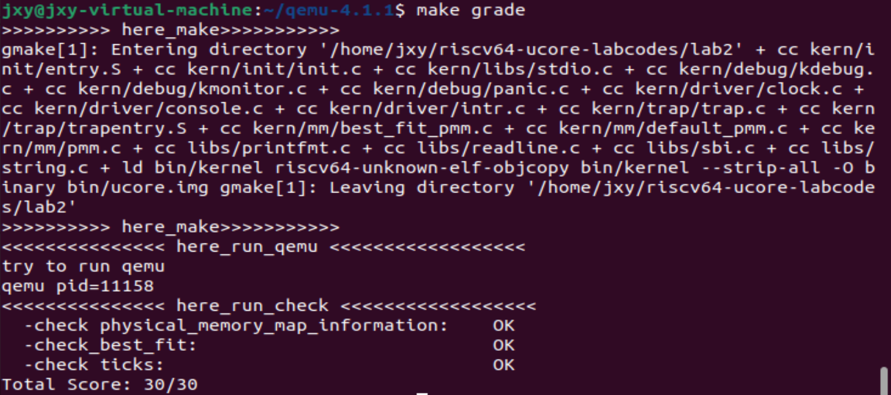

###Lab2
####练习1：理解first-fit 连续物理内存分配算法
####程序进行物理内存分配的过程

**初始化内存管理**： 在系统启动时，内核会初始化内存管理子系统，记录系统中可用的物理内存块，并维护有关内存分配的数据结构。在本次实验中，kern_init函数在完成一些输出并对lab1实验结果的检查后，将进入物理内存管理初始化的工作，调用流程为：kern_init()-> pmm_init()–>page_init()–>init_memmap()。其中，pmm_init()主要就是用来主要负责初始化物理内存管理，

在default_init_memmap()函数中，过滤掉了内核中的一些保留页面，将连续的空闲页面存储在了一个空链表中，便于后续进程分配时候查找。

下面将详细分析各个函数的作用。

**内存分配请求**： 当程序需要分配内存时，会向操作系统发出内存分配请求。这可以通过系统调用（如malloc、calloc等）或其他方式来完成。

**内存分配算法**： 操作系统使用特定的内存分配算法来满足请求。常见的算法包括

`First Fit`:在内存中找到第一个足够大的空闲块来分配。

`Best Fit`:在内存中找到最接近所需大小的空闲块。

`Worst Fit`在内存中找到最大的空闲块，以便在剩余空间中留下更多可用内存。

**内存分配操作**： 一旦找到适当的空闲块，操作系统将
执行以下四步操作

(1)将块标记为已分配，并将分配的内存空间的位置和大小记录下来。

(2)保护分配的内存，以防止越界访问。

(3)将分配的内存地址返回给请求进程，以便进程可以使用它。

(4)当进程不再需要分配的内存时，它通过系统调用或其他方式通知操作系统释放内存。

内存分配操作由default_alloc_pages()函数执行。在该函数中通过从头遍历空链表中的节点，判断该节点连续空闲页面的大小是否够进程使用。如果足够进程使用(p->property>=n)，则将该空间进行划分，把适应大小的空间分配给进程；反之继续遍历空闲链表。

**内存释放操作**： 一旦接收到内存释放请求，操作系统会执行以下四步操作

(1)将该内存块标记为未分配。

(2)执行内存块合并操作，以合并相邻的空闲块，减少内存碎片。

(3)将内存标记为可用，并添加到空闲内存链表或其他数据结构中。

(4)处理一些可能的错误情况，如内存不足、非法内存访问等。

内存释放操作由default_free_pages()函数执行。在该函数中将空间进行回收并进行一些细碎空间的合并。

**内存管理优化**： 操作系统可以使用各种技术来优化内存管理，包括虚拟内存、页面置换算法、伙伴系统等，以提高内存使用效率和系统性能。

####设计思路
物理内存页管理器顺着**双向循环链表**进行搜索空闲内存区域，直到找到一个足够大的空闲区域，因为它尽可能少地搜索链表。如果空闲区域的大小和申请分配的大小正好一样，则把这个空闲区域分配出去，成功返回；否则将该空闲区分为两部分，一部分区域与申请分配的大小相等，把它分配出去，剩下的一部分区域形成新的空闲区。释放时把这块区域重新放回双向链表中，同时对细碎的可以合并的小空间进行合并。

####函数分析
`default_init()`函数主要用于初始化。首先利用`list_init()`函数初始化一个空闲列表，用于管理可用的物理页面，然后定义一个全局变量`nr_free`，用于记录可用的物理页面数。代码如下：
```C
static void
default_init(void) 
{
    list_init(&free_list);
    nr_free = 0;//nr_free可以理解为在这里可以使用的一个全局变量，记录可用的物理页面数
}
```

`default_init_memmap()`函数的作用是初始化一组物理页面，并将它们添加到空闲的列表中。它的调用过程为kern_init()-> pmm_init()–>page_init()–>init_memmap()。代码如下：
```C
static void
default_init_memmap(struct Page *base, size_t n) 
{
    assert(n > 0);
    struct Page *p = base;// 用指针p遍历物理页面数组，对每个页面进行初始化
    for (; p != base + n; p ++) 
    {
        // 确保页面是保留页面（Reserved Page）
        assert(PageReserved(p));
        // 清空页面的标志和属性
        p->flags = p->property = 0;
        //将页面引用计数设置为0
        set_page_ref(p, 0);
    }
    // 设置第一个物理页面的属性为n，表示连续n个页面
    base->property = n;
    // 设置第一个物理页面的Property标志
    SetPageProperty(base);
    // 增加可用物理页面数量
    nr_free += n;
    if (list_empty(&free_list)) // 如果空闲列表为空，将当前页面添加到空闲列表
    {
        list_add(&free_list, &(base->page_link));
    } 
    else // 如果空闲列表不为空，遍历列表找到合适的位置插入当前页面
    {
        list_entry_t* le = &free_list;
        while ((le = list_next(le)) != &free_list) {
            struct Page* page = le2page(le, page_link);
            if (base < page) // 插入到当前位置之前
            {
                list_add_before(le, &(base->page_link));  //将base指向的块加到le之前
                break;
            } 
            else if (list_next(le) == &free_list) // 插入到列表末尾
            {
                list_add(le, &(base->page_link)); //将base指向的块加到le之后
            }
        }
    }
}
```

`default_alloc_pages()`函数的作用是从一个空闲页面列表中分配一块大小为 n 的物理页面块。流程为：从起始位置开始顺序搜索空闲块链表，找到第一个页数不小于所申请页数n的块（只需检查每个Page的property成员，在其值>=n的第一个页停下），如果这个块的页数正好等于申请的页数，则可直接分配；如果页数比申请的页数多，要将块分成两半，将起始地址较低的一半分配出去，将起始地址较高的一半作为链表内新的块，分配完成后重新计算块内空闲页数和全局空闲页数；若遍历整个空闲链表仍找不到足够大的块，则返回NULL表示分配失败。代码如下：
```C
static struct Page *
default_alloc_pages(size_t n) 
{
    assert(n > 0);// 确保要分配的页面数量大于0
    // 如果要分配的页面数量大于可用的页面数量，无法分配，返回NULL
    if (n > nr_free) 
    {
        return NULL;
    }
    struct Page *page = NULL;// 初始化一个指向物理页面的指针
    list_entry_t *le = &free_list;
    // 遍历空闲页面列表，寻找合适大小的页面块
    while ((le = list_next(le)) != &free_list) 
    {
        struct Page *p = le2page(le, page_link);
        // 如果找到一个大小符合要求的页面块，将其分配
        if (p->property >= n) 
        {
            page = p;
            break;
        }
    }
    // 如果找到了符合要求的页面块
    if (page != NULL) 
    {
        // 从空闲页面列表中删除已分配的页面块
        list_entry_t* prev = list_prev(&(page->page_link));
        list_del(&(page->page_link));
        // 如果剩余的页面块大小大于n，将剩余部分重新加入到空闲页面列表
        if (page->property > n) 
        {
            struct Page *p = page + n;
            p->property = page->property - n;
            SetPageProperty(p);
            list_add(prev, &(p->page_link));
        }
        // 更新可用页面数量和清除页面的Property标志
        nr_free -= n;
        ClearPageProperty(page);
    }
    return page;
}
```

`default_free_pages()`的作用是释放从指定的某一物理页开始的若干个被占用的连续物理页，将这些页放回空闲块链表，重置其中的标志信息，最后进行一些碎片整理性质的块合并操作。代码如下：
```C
static void
default_free_pages(struct Page *base, size_t n) 
{
    assert(n > 0);// 确保要释放的页面数量大于0
    struct Page *p = base;
    // 使用指针p来遍历要释放的页面块
    for (; p != base + n; p ++) 
    {
        // 确保页面不是保留页面（PageReserved）且不是具有属性（PageProperty）
        assert(!PageReserved(p) && !PageProperty(p));
        // 清除页面的标志位，将引用计数设为0
        p->flags = 0;
        set_page_ref(p, 0);
    }
    // 将基地址页面设置为具有属性（PageProperty）并设置其属性值为n
    base->property = n;
    SetPageProperty(base);
    nr_free += n;// 增加可用页面数量

    // 如果空闲页面列表为空，直接将基地址页面加入列表
    if (list_empty(&free_list)) 
    {
        list_add(&free_list, &(base->page_link));
    } 
    else // 否则，遍历空闲页面列表，找到适当的位置插入基地址页面
    {
        list_entry_t* le = &free_list;  //le从空闲列表头开始遍历
        while ((le = list_next(le)) != &free_list)  //如果le的下一个不是空闲列表的头，即le不是空闲列表的尾
        {
            struct Page* page = le2page(le, page_link);
            if (base < page) //找到合适的位置插入
            {
                list_add_before(le, &(base->page_link));
                break;
            } 
            else if (list_next(le) == &  free_list)   //如果le下一个是空闲列表的头，即le是空闲列表的尾
            {
                list_add(le, &(base->page_link));   //直接插入到空闲列表的最后一个，即le的下一个
            }
        }
    }
    // 尝试合并相邻的空闲页面块
    list_entry_t* le = list_prev(&(base->page_link));   //令le为当前base的前一个
    if (le != &free_list) //如果le不是空闲列表的头（空闲列表的头为空指针）
    {
        p = le2page(le, page_link);
        if (p + p->property == base) 
        {
            p->property += base->property;
            ClearPageProperty(base);
            list_del(&(base->page_link));
            base = p;
        }
    }

    le = list_next(&(base->page_link)); //令le为当前base的后一个
    if (le != &free_list)   //如果le不是头，即base不是尾
    {
        p = le2page(le, page_link);
        if (base + base->property == p)   //如果base加上偏移量正好为下一个块的首地址，说明两个块连续，则将base和base后面的块合并
        {
            base->property += p->property;
            ClearPageProperty(p);
            list_del(&(p->page_link));
        }
    }
}
```
####算法改进
first_fit算法在进行分配以及释放内存的时候，在双向链表上进行操作的时间复杂度为O(n)，如果使用二又搜索树对地址进行排序，从而对进程进行管理，就可以在查找页块时将时间复杂度降到O(logn)。

####练习2：实现 Best-Fit 连续物理内存分配算法

####设计思路
best_fit算法依然采用**双向循环链表**，物理内存页管理器顺着双向链表进行搜索空闲内存区域，best_fit算法不仅仅局限于找到，而是要找到大小最为合适的空闲块（即尽量找到满足且最小的块）。如果空闲区域的大小和申请分配的大小正好一样，则把这个空闲区域分配出去，成功返回；否则将该空闲区分为两部分，一部分区域与申请分配的大小相等，把它分配出去，剩下的一部分区域形成新的空闲区。主要增加了一个min_size全局变量，用于记录当前链表中最小的空闲块大小，便于进行比较以找到大小最为合适的空闲块。释放时把这块区域重新放回双向链表中，同时合并首尾相接的细碎小空间。

`best_fit_init()`函数同样用于初始化。首先利用`list_init()`函数初始化一个空闲列表，用于管理可用的物理页面，然后定义一个全局变量`nr_free`，用于记录可用的物理页面数。代码如下：
```C
static void
best_fit_init(void) {
    list_init(&free_list);
    nr_free = 0;
}
```

`best_fit_init_memmap()`函数的作用仍旧是是初始化一组物理页面，并将它们添加到空闲的列表中。它的调用过程为kern_init()-> pmm_init()–>page_init()–>init_memmap()。和First的区别在于需要添加一行ClearPageProperty(p)的代码，用于清空当前页框的标志和属性信息。由于best fit算法适用于找到最接近所需大小的空闲块，因此需要对空闲块进行大小的排序，运行ClearPageProperty()函数可以最大限度地保证代码运行的正确性。填写后的代码如下：
```C
static void
best_fit_init_memmap(struct Page *base, size_t n) {
    assert(n > 0);
    struct Page *p = base;
    for (; p != base + n; p ++) {
        assert(PageReserved(p));
        /*LAB2 EXERCISE 2: YOUR CODE*/ 
        // 清空当前页框的标志和属性信息，并将页框的引用计数设置为0
        ClearPageProperty(p);
        p->flags = p->property=0;
        set_page_ref(p, 0);
    }
    base->property = n;
    SetPageProperty(base);
    nr_free += n;
    if (list_empty(&free_list)) {
        list_add(&free_list, &(base->page_link));
    } else {
        list_entry_t* le = &free_list;
        while ((le = list_next(le)) != &free_list) {
            struct Page* page = le2page(le, page_link);
             /*LAB2 EXERCISE 2: YOUR CODE*/ 
            // 编写代码
            // 1、当base < page时，找到第一个大于base的页，将base插入到它前面，并退出循环
            // 2、当list_next(le) == &free_list时，若已经到达链表结尾，将base插入到链表尾部
            if (base < page) 
            {
                list_add_before(le, &(base->page_link));  //表示将base所指向的块插到le之前，并退出循环
                break;
            } 
            else if (list_next(le) == &free_list)   //如果le的下一位是空闲列表的头，即le已经遍历到了空闲列表的尾，则直接将base所指向的块插入到le的后面
            {
                list_add(le, &(base->page_link));       
            }
        }
    }
}
```

`best_fit_alloc_pages()`函数的作用同样是从一个空闲页面列表中分配一块大小为 n 的物理页面块。和first_fit相比，best_fit算法需要找到一个运行所需大小的空闲块，因此在循环的判断条件中要有所区分。通过构造变量min_size用于记录当前链表所有块中最小空闲块大小，在Best Fit 算法中，分配器会在可用的内存块中查找一个大小最接近所需大小的块，同时不小于min_size。这有助于最大限度地减小内存碎片，并提高内存利用率。填写后的代码如下：
```C
static struct Page *
best_fit_alloc_pages(size_t n) {
    assert(n > 0);
    if (n > nr_free) {
        return NULL;
    }
    struct Page *page = NULL;
    list_entry_t *le = &free_list;
    size_t min_size = nr_free + 1;
     /*LAB2 EXERCISE 2: YOUR CODE*/ 
    // 下面的代码是first-fit的部分代码，请修改下面的代码改为best-fit
    // 遍历空闲链表，查找满足需求的空闲页框
    // 如果找到满足需求的页面，记录该页面以及当前找到的最小连续空闲页框数量
    while ((le = list_next(le)) != &free_list)       //如果没有遍历一圈，则一直遍历
    {
        struct Page *p = le2page(le, page_link);       
        if (p->property >= n && p->property < min_size)    //如果此时的p所指向的块可以为内存提供足够的空间，同时这个块的大小又比之前遍历到的最小值还要小，则选择将该块的内存分配给进程
        {
            page = p;                  //更新page的值
            min_size = p->property;    //更新min_size的值
        }
    }
    /*
    while ((le = list_next(le)) != &free_list) {
        struct Page *p = le2page(le, page_link);
        if (p->property >= n) {
            page = p;
            break;
        }
    }
    */

    if (page != NULL)     //如果page不为空，则说明可以为该进程分配空间
    {
        list_entry_t* prev = list_prev(&(page->page_link)); 
        list_del(&(page->page_link));   //从空闲列表中将page删除
        if (page->property > n)          //如果page的块大小大于n，则需要将page分割
        {
            struct Page *p = page + n;
            p->property = page->property - n;    //更新page此时的块大小
            SetPageProperty(p);
            list_add(prev, &(p->page_link));     //将新的page节点加到prev的后面
        }
        nr_free -= n;               //更新整个内存块可以存储的空间值
        ClearPageProperty(page);
    }
    return page;
}
```

`best_fit_free_pages()`的作用是释放从指定的某一物理页开始的若干个被占用的连续物理页，将这些页放回空闲块链表，重置其中的标志信息，最后进行一些碎片整理性质的块合并操作。和first_fit算法相同，在释放物理页面是，要先将其属性设置为释放的页块数，并将页块标记为已分配。填写后的代码如下：
```C
static void
best_fit_free_pages(struct Page *base, size_t n) {
    assert(n > 0);
    struct Page *p = base;
    for (; p != base + n; p ++) {
        assert(!PageReserved(p) && !PageProperty(p));
        p->flags = 0;
        set_page_ref(p, 0);
    }
    /*LAB2 EXERCISE 2: YOUR CODE*/ 
    // 编写代码
    // 具体来说就是设置当前页块的属性为释放的页块数、并将当前页块标记为已分配状态、最后增加nr_free的值
    base->property = n;
    SetPageProperty(base);
    nr_free += n;
    

    if (list_empty(&free_list)) {
        list_add(&free_list, &(base->page_link));
    } else {
        list_entry_t* le = &free_list;
        while ((le = list_next(le)) != &free_list) {
            struct Page* page = le2page(le, page_link);
            if (base < page) {
                list_add_before(le, &(base->page_link));
                break;
            } else if (list_next(le) == &free_list) {
                list_add(le, &(base->page_link));
            }
        }
    }

    list_entry_t* le = list_prev(&(base->page_link));
    if (le != &free_list)    //空链表头为空指针
    {
        p = le2page(le, page_link);
        /*LAB2 EXERCISE 2: YOUR CODE*/ 
         // 编写代码
        // 1、判断前面的空闲页块是否与当前页块是连续的，如果是连续的，则将当前页块合并到前面的空闲页块中
        // 2、首先更新前一个空闲页块的大小，加上当前页块的大小
        // 3、清除当前页块的属性标记，表示不再是空闲页块
        // 4、从链表中删除当前页块
        // 5、将指针指向前一个空闲页块，以便继续检查合并后的连续空闲页块
        if (p + p->property == base)    //向前合并
        {
            p->property += base->property;
            ClearPageProperty(base);
            list_del(&(base->page_link));
            base = p;
        }
    }

    le = list_next(&(base->page_link));
    if (le != &free_list)         //le不为头，即base所指向的块不为空闲块链表的尾
    {
        p = le2page(le, page_link);
        if (base + base->property == p)  //向后合并
        {
            base->property += p->property;
            ClearPageProperty(p);
            list_del(&(p->page_link));
        }
    }
}
```
####算法改进
同样，best_fit算法在进行分配以及释放内存的时候，在双向链表上进行操作的时间复杂度也为O(n)，如果使用二又搜索树对地址进行排序，从而对进程进行管理，就可以在查找页块时将时间复杂度降到O(logn)。

####结果展示


####Challenge1：buddy system（伙伴系统）分配算法
####Challenge2：任意大小的内存单元slub分配算法
####Challenge3：硬件的可用物理内存范围的获取方法

####Lab2实验总结
通过本次实验，了解了物理内存的分配方式以及页表的建立和使用，并通过编程体验了如何更高效的管理物理内存。物理内存是计算机中用于存储程序和数据的硬件资源，合理管理物理内存对系统性能至关重要。本次实验中学习并理解了first-fit 连续物理内存分配算法，并且参考First Fit算法编程实现了Best-Fit 连续物理内存分配算法。我们比较了这两个算法的时空复杂度并提出了优化方案，使物理内存管理更加高效、合理。页表是用于虚拟内存管理的关键数据结构，它将虚拟内存地址映射到物理内存地址。在实验中，我们学到了如何实现一个简单的页表映射，也就是如何使用页表来管理虚拟内存。总的来说，通过对物理内存管理和页表的学习，我们对操作系统有了更深刻的理解。