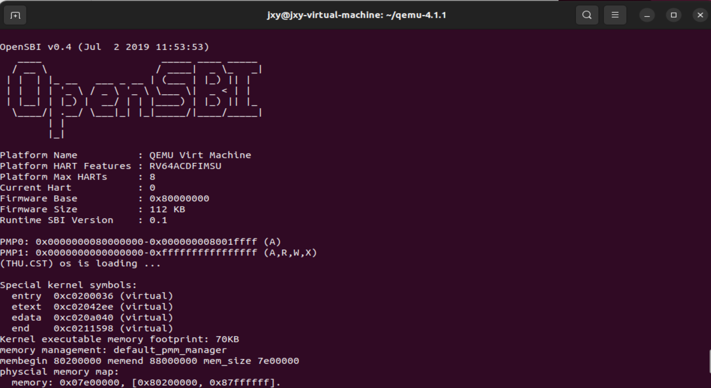
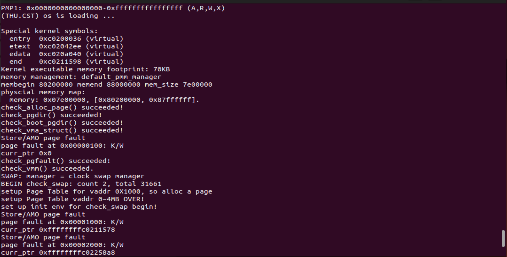
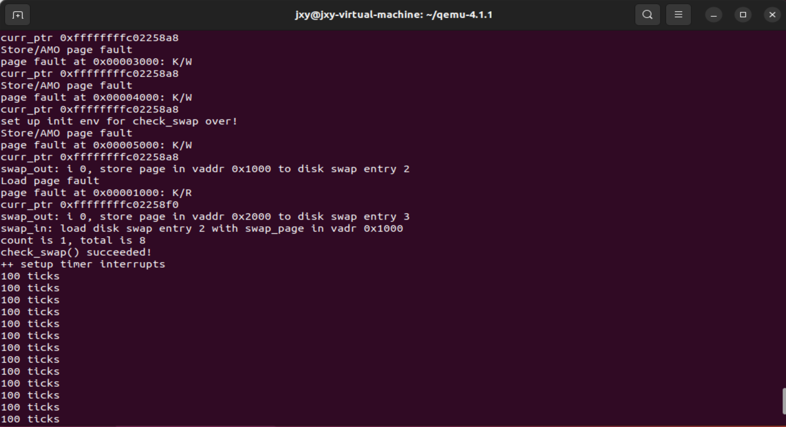
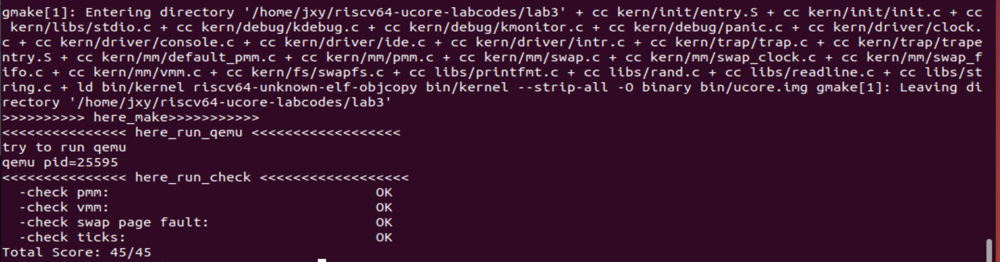

###Lab3
####练习1：理解基于FIFO的页面替换算法（思考题）
#####问题：
描述FIFO页面置换算法下，一个页面从被换入到被换出的过程中，会经过代码里哪些函数/宏的处理（或者说，需要调用哪些函数/宏），并用简单的一两句话描述每个函数在过程中做了什么？

**过程简述：当发生缺页异常时，需要添加新的页块，调用alloc_pages()函数，而alloc_pages()函数会调用swap_out()函数，即swap_out()函数会根据alloc_pages()函数中需要的页面数量，在当前的内存中换出页面。页面换出后，会调用swap_in()函数进行页面的换入。**

• 当CPU访问虚拟内存地址，而MMU没有办法找到对应的物理地址映射关系时，便会发生缺页异常。首先会到trap.c中进行异常的分类，可以看到有`CAUSE_LOAD_PAGE_FAULT `和`CAUSE_STORE_PAGE_FAULT`两种情况，异常处理程序会把 Page Fault分发给kern/mm/vmm.c的do_pgfault()函数并尝试进行页面置换。  
• 在do_pgfault()函数中，首先会判断页块是否存在，如果不存在则会调用函数pgdir_alloc_page()为页面分配内存。在初始化都成功后，会调用swap_in()进行页面换入(即从硬盘读取到内存)，过程如下：  
**分配了一个物理页面alloc_page()->get_pte()->页目录表[1]->页表[0]->页表项->虚拟地址->swafs_read()从磁盘读取到内存->page_insert->更新TLB(pmm.c/tlb_invalidate())**

在swap_in()函数和pgdir_alloc_page()函数中会先为要插入的页面分配空间，这里面用到的alloc_pages()函数在pmm.c中定义，该函数会调用swap_out()函数，当程序需要分配新的页面且当前物理内存中已经没有空闲页面可以使用时，进行页面换出,过程如下：  
**swap_in()/pgdir_alloc_page()->pmm.c/alloc_pages->swap.c/swap_out->swap_out_victim(swap_fifo.c)->ptr(被换出的页表块(vma)的第一个页地址)->get_pte->页目录表[1]->页表[0]->页表项->物理内存地址->被换出的页**

**接下来详细分析其中所使用到的函数：**

**换入**

**trap.c/exception_handler()**
```C
 case CAUSE_LOAD_PAGE_FAULT:
    cprintf("Load page fault\n");
    if ((ret = pgfault_handler(tf)) != 0) {
        print_trapframe(tf);
        panic("handle pgfault failed. %e\n", ret);
    }
    break;
case CAUSE_STORE_PAGE_FAULT:
    cprintf("Store/AMO page fault\n");
    if ((ret = pgfault_handler(tf)) != 0) {
        print_trapframe(tf);
        panic("handle pgfault failed. %e\n", ret);
    }
    break;
```
exception_handler对错误类型进行区分，然后调用相应的函数进行处理。上面两种情况分别处理加载和存储页错误。输出相应类型的页错误信息，然后调用pgfault_handler()函数尝试处理错误。如果处理失败，打印中断帧信息并触发内核恢复，终止程序执行。
此函数中还存在CAUSE_MISALIGNED_FETCH（指令不对齐）、CAUSE_FETCH_ACCESS（指令访问异常）等错误类型，当发生这些异常时，都会立即输出页的异常信息，并终止程序执行，但并不存在尝试处理的情况。

**vmm.c/do_pgfault()部分**
```C
ptep = get_pte(mm->pgdir, addr, 1); 
    if (*ptep == 0) {
        if (pgdir_alloc_page(mm->pgdir, addr, perm) == NULL) {
            cprintf("pgdir_alloc_page in do_pgfault failed\n");
            goto failed;
        }
    } else {
        if (swap_init_ok) {
            struct Page *page = NULL;
            if(swap_in(mm,addr,&page)!=0)
            {
                cprintf("swap_in in do_pgfault failed\n");
                goto failed;
            }
            page_insert(mm->pgdir,page,addr,perm);
            swap_map_swappable(mm,addr,page,1);
            page->pra_vaddr = addr;
        } else {
            cprintf("no swap_init_ok but ptep is %x, failed\n", *ptep);
            goto failed;
        }
   }
```
do_pault()函数主要是在处理页面异常时，尝试根据给定的地址在虚拟内存空间中找到对应的页表项。如果找到了对应的页表项，会根据情况执行不同的操作，包括页表项的分配、页面的换入等操作。如果发生错误，会打印错误信息，并返回错误。以上展示的部分代码首先实现找寻一个页块，如果找不到则初始化一个页块的功能。然后将磁盘中的内容读取到内存中。

**pmm.c/pgdir_alloc_page()**
```C
struct Page *pgdir_alloc_page(pde_t *pgdir, uintptr_t la, uint32_t perm) {
    struct Page *page = alloc_page();
    if (page != NULL) {
        if (page_insert(pgdir, page, la, perm) != 0) {
            free_page(page);
            return NULL;
        }
        if (swap_init_ok) {
            swap_map_swappable(check_mm_struct, la, page, 0);
            page->pra_vaddr = la;
            assert(page_ref(page) == 1);
        }
    }
    return page;
}
```
该函数用于在页目录中分配一个新的物理页，并将其映射到给定的虚拟地址上。如果映射成功，还会执行与交换相关的一些操作。如果出现任何错误，将会释放已分配的物理页并返回 NULL。

**swap.c/swap_in()**
```C
int
swap_in(struct mm_struct *mm, uintptr_t addr, struct Page **ptr_result)
{
     struct Page *result = alloc_page();
     assert(result!=NULL);

     pte_t *ptep = get_pte(mm->pgdir, addr, 0);
     // cprintf("SWAP: load ptep %x swap entry %d to vaddr 0x%08x, page %x, No %d\n", ptep, (*ptep)>>8, addr, result, (result-pages));
    
     int r;
     if ((r = swapfs_read((*ptep), result)) != 0)
     {
        assert(r!=0);
     }
     cprintf("swap_in: load disk swap entry %d with swap_page in vadr 0x%x\n", (*ptep)>>8, addr);
     *ptr_result=result;
     return 0;
}
```
该段代码主要实现了从交换文件中读取数据，并将其加载到指定虚拟地址上，然后将加载的物理页的地址存储在 `ptr_result` 中。如果加载失败，它可能会触发断言错误或返回适当的错误代码。

**pmm.c/page_insert()**
```C
int page_insert(pde_t *pgdir, struct Page *page, uintptr_t la, uint32_t perm) {
    pte_t *ptep = get_pte(pgdir, la, 1);
    if (ptep == NULL) {
        return -E_NO_MEM;
    }
    page_ref_inc(page);
    if (*ptep & PTE_V) {
        struct Page *p = pte2page(*ptep);
        if (p == page) {
            page_ref_dec(page);
        } else {
            page_remove_pte(pgdir, la, ptep);
        }
    }
    *ptep = pte_create(page2ppn(page), PTE_V | perm);
    tlb_invalidate(pgdir, la);
    return 0;
}
```
这段代码用于在页表中插入一个新的虚拟地址到物理页的映射关系，并对快表（TLB）进行了更新，方便下次更快速的访问。

**vmm.c/swap_map_swappable**
```C
swap_map_swappable(struct mm_struct *mm, uintptr_t addr, struct Page *page, int swap_in)
{
     return sm->map_swappable(mm, addr, page, swap_in);
}
```
**swap_fifo.c/**
```C
_fifo_map_swappable(struct mm_struct *mm, uintptr_t addr, struct Page *page, int swap_in)
{
    list_entry_t *head=(list_entry_t*) mm->sm_priv;
    list_entry_t *entry=&(page->pra_page_link);
 
    assert(entry != NULL && head != NULL);
    list_add(head, entry);
    return 0;
}
```
在上面两个代码中，swap_map_swappable调用_fifo_map_swappable。实现了FIFO页面置换策略的一部分。它将新到达的页面添加到一个队列的末尾，以确保最近到达的页面将被最先淘汰。

**换出**

**pmm.c/*alloc_pages()***
```C
struct Page *alloc_pages(size_t n) {
    struct Page *page = NULL;
    bool intr_flag;

    while (1) {
        local_intr_save(intr_flag);
        { page = pmm_manager->alloc_pages(n); }
        local_intr_restore(intr_flag);

        if (page != NULL || n > 1 || swap_init_ok == 0) break;

        extern struct mm_struct *check_mm_struct;
        // cprintf("page %x, call swap_out in alloc_pages %d\n",page, n);
        swap_out(check_mm_struct, n, 0);
    }
    // cprintf("n %d,get page %x, No %d in alloc_pages\n",n,page,(page-pages));
    return page;
}
```
这段代码用于尝试分配指定数量的页面。如果分配成功，或者需要分配多于一个页面，或者内存交换未初始化完成，它将跳出循环并返回分配的页面指针。如果分配失败，并且需要分配多个页面，并且内存交换已经初始化，那么可能会调用 `swap_out` 函数来执行页面交换操作。

**swap.c/swap_out()**
```C
int
swap_out(struct mm_struct *mm, int n, int in_tick)
{
     int i;
     for (i = 0; i != n; ++ i)
     {
          uintptr_t v;
          //struct Page **ptr_page=NULL;
          struct Page *page;
          // cprintf("i %d, SWAP: call swap_out_victim\n",i);
          int r = sm->swap_out_victim(mm, &page, in_tick);
          if (r != 0) {
                    cprintf("i %d, swap_out: call swap_out_victim failed\n",i);
                  break;
          }          
          //assert(!PageReserved(page));

          //cprintf("SWAP: choose victim page 0x%08x\n", page);
          
          v=page->pra_vaddr; 
          pte_t *ptep = get_pte(mm->pgdir, v, 0);
          assert((*ptep & PTE_V) != 0);

          if (swapfs_write( (page->pra_vaddr/PGSIZE+1)<<8, page) != 0) {
                    cprintf("SWAP: failed to save\n");
                    sm->map_swappable(mm, v, page, 0);
                    continue;
          }
          else {
                    cprintf("swap_out: i %d, store page in vaddr 0x%x to disk swap entry %d\n", i, v, page->pra_vaddr/PGSIZE+1);
                    *ptep = (page->pra_vaddr/PGSIZE+1)<<8;
                    free_page(page);
          }
          
          tlb_invalidate(mm->pgdir, v);
     }
     return i;
}
```
这段代码是一个用于页面交换的函数。通过循环选择、写入磁盘、更新页表等步骤，将内存中的页面数据移出到磁盘上的交换文件中，以释放物理内存。

**swap_fifo.c/_fifo_swap_out_victim()**
```C
_fifo_swap_out_victim(struct mm_struct *mm, struct Page ** ptr_page, int in_tick)
{
     list_entry_t *head=(list_entry_t*) mm->sm_priv;
         assert(head != NULL);
     assert(in_tick==0);
     /* Select the victim */
     //(1)  unlink the  earliest arrival page in front of pra_list_head qeueue
     //(2)  set the addr of addr of this page to ptr_page
    list_entry_t* entry = list_prev(head);
    if (entry != head) {
        list_del(entry);
        *ptr_page = le2page(entry, pra_page_link);
    } else {
        *ptr_page = NULL;
    }
    return 0;
}
```
这段代码是FIFO算法的核心实现部分，通过在队列头部选择最早到达的页面，并将其从队列中移除，返回给调用者以进行后续处理。如果队列为空，它会返回一个空指针。

**pmm.c/tlb_invalidate()**
```C
void tlb_invalidate(pde_t *pgdir, uintptr_t la) 
{ 
    flush_tlb(); 
}
```
这段代码在页面信息更新后进行了快表（TLB）的刷新，即更新了已完成的虚拟页号到物理页号的映射。

**需要用到的其它函数**

**ide.c/ide_read_secs()**
```C
int ide_read_secs(unsigned short ideno, uint32_t secno, void *dst,
                  size_t nsecs) {
    int iobase = secno * SECTSIZE;
    memcpy(dst, &ide[iobase], nsecs * SECTSIZE);
    return 0;
}
```
这段代码将磁盘上指定扇区的数据读取到内存中，其中使用memcpy直接复制数据来模仿这个过程，且传输的数据必须是512字节的倍数并且需要对齐。**(磁盘->内存)**

**ide.c/ide_write_secs()**
```C
int ide_write_secs(unsigned short ideno, uint32_t secno, const void *src,
                   size_t nsecs) {
    int iobase = secno * SECTSIZE;
    memcpy(&ide[iobase], src, nsecs * SECTSIZE);
    return 0;
}
```
这段代码将内存中的数据写入到磁盘中，与上一个读取数据类似。**(内存->磁盘)**

***

####练习2：深入理解不同分页模式的工作原理（思考题）
#####问题1：get_pte()函数（位于kern/mm/pmm.c）用于在页表中查找或创建页表项，从而实现对指定线性地址对应的物理页的访问和映射操作。这在操作系统中的分页机制下，是实现虚拟内存与物理内存之间映射关系非常重要的内容。get_pte()函数中有两段形式类似的代码， 结合sv32，sv39，sv48的异同，解释这两段代码为什么如此相像。

**sv32，sv39，sv48的异同**  
sv32、sv39 和 sv48 是 RISC-V 指令集架构中的不同虚拟内存扩展，它们定义了不同位数的虚拟地址和物理地址，以及不同的页表结构。

**sv32**：
sv32 扩展使用 **32** 位虚拟地址;支持 **32** 位物理地址;使用 **2** 级页表结构，包括页目录（一级页表）和页表（二级页表）。页表项大小为 4 字节。虚拟地址被分为 **10** 位页目录索引、**10** 位页表索引和 **12** 位页内偏移。页目录索引用于查找页表基地址，页表索引用于查找物理页帧号。

**sv39**
sv39 扩展使用 **39** 位虚拟地址;支持 **32位或39位** 物理地址，具体取决于实现;使用 **3** 级页表结构，包括页目录（一级页表）、页表（二级页表）和页。虚拟地址被分为 **9** 位页目录索引、**9** 位页表索引和 **21** 位页内偏移。查找地址时，首先查找页目录来找到页表的基地址，然后查找页表来找到页的基地址，最后查找页来获取帧号，最终将帧号与页内偏移相加以生成物理地址。

**sv48**
sv48 扩展使用 **48** 位虚拟地址;支持 **39位或48位** 物理地址，具体取决于实现;使用 **4** 级页表结构，包括页目录（一级页表）、页表（二级页表）、页表（三级页表）和页。虚拟地址被分为不同位数的页目录索引、页表索引和页内偏移，具体位数取决于实现。查找地址时，通过四级页表进行地址转换，查找多个级别的页表以获取帧号，然后将帧号与页内偏移相加以生成物理地址。

**get_ptr代码分析**  
```C
pde_t *pdep1 = &pgdir[PDX1(la)];
//从pgdir数组中获取一个页目录项（Page Directory Entry）
if (!(*pdep1 & PTE_V)) {//检查 *pdep1 中的页表项是否有效
    struct Page *page;//无效则分配一个新的物理页
    if (!create || (page = alloc_page()) == NULL) 
    {//检查是否成功分配
        return NULL;
    }
    set_page_ref(page, 1);//增加新页的引用计数
    uintptr_t pa = page2pa(page);//计算新页的物理地址 pa
    memset(KADDR(pa), 0, PGSIZE);//使用 memset 初始化新页的内容为0
    *pdep1 = pte_create(page2ppn(page), PTE_U | PTE_V);
    //使用 pte_create 函数创建一个页表项，并将其设置为有效（V标志位为1）和用户可读写（U标志位为1）。
    //将新创建的页表项写入 *pdep1 中，以便将其与物理页关联起来
}
pde_t *pdep0 = &((pde_t *)KADDR(PDE_ADDR(*pdep1)))[PDX0(la)];
//获取一个页目录项 *pdep1 对应的页表（Page Table），并找到该页表中的一个页表项。
if (!(*pdep0 & PTE_V)) {//检查 *pdep0 中的页表项是否有效
    struct Page *page;
    if (!create || (page = alloc_page()) == NULL) {
    	return NULL;
    }
    set_page_ref(page, 1);
    uintptr_t pa = page2pa(page);
    memset(KADDR(pa), 0, PGSIZE);
 //   memset(pa, 0, PGSIZE);
    *pdep0 = pte_create(page2ppn(page), PTE_U | PTE_V);
}
return &((pte_t *)KADDR(PDE_ADDR(*pdep0)))[PTX(la)];
```
上述代码中的`pde_t *pdep1 = &pgdir[PDX1(la)]`通过 `PDX1(la)` 函数获取虚拟地址 la 对应的一级页表项（Page Directory Entry）。`pde_t *pdep0 = &((pde_t *)KADDR(PDE_ADDR(*pdep1)))[PDX0(la)]`
通过一级页表项 pdep1 中的信息，获取到对应的二级页表项。结合sv32，sv39以及sv48的知识我们可以知道，不管是sv32，sv39还是sv48，都会有一级和二级页表。上述这两段代码是通用的，适用于不同的RISC-V页表模式，如sv32、sv39和sv48。不同的模式主要涉及页表的深度和具体结构，但基本的页表操作原则保持相同，因此是十分相似的。

#####问题2:目前get_pte()函数将页表项的查找和页表项的分配合并在一个函数里，你认为这种写法好吗？有没有必要把两个功能拆开？

在目前的函数功能中，调用该函数时大多数是为了进行内存的分配，如果一个页表项没有找到，及时的分配一个新的页表项可以更快速的进行内存的分配，避免了反复调用函数造成更大的开销。

***

####练习3：给未被映射的地址映射上物理页（需要编程）
#####重点代码分析
```C
extern list_entry_t *curr_ptr;
cprintf("curr_ptr %p\n", (void*)curr_ptr);
```
首先利用代码可以输出curr_ptr指针的位置。
```C
int ret = -E_INVAL;
struct vma_struct *vma = find_vma(mm, addr);
```
`int ret = -E_INVAL`这个代码声明了一个整数变量 ret，并将其初始化
为 `-E_INVAL`。`-E_INVAL`是一个预定义的错误代码或标志，表示某种无效或错误的条件。
`struct vma_struct *vma = find_vma(mm, addr)`调用 `find_vma `函数来查找在地址 addr 处的虚拟内存区域（VMA），并将结果存储在名为 vma 的指针变量中。
```C
uint32_t perm = PTE_U;
if (vma->vm_flags & VM_WRITE) {
    perm |= (PTE_R | PTE_W);
}
```
if语句通过参考页面vma的权限，如果具有写权限，即可设置访问权限为读写。
```C
ptep = get_pte(mm->pgdir, addr, 1);  
```
调用get_pte()函数来获取页表项（Page Table Entry，PTE）的地址，并将结果存储在名为 ptep 的指针变量中。第三个参数 1 表示如果页表项不存在则尝试创建。

接下来首先判断页表项地址是否为空，如果为空则说明没有映射到物理页面，则需要尝试分配一个新的物理页。如果不为空，则进一步查看页面是否可交换。

```C
if (swap_init_ok) 
{
    struct Page *page = NULL;
    if(swap_in(mm,addr,&page)!=0)
    {
        cprintf("swap_in in do_pgfault failed\n");
        goto failed;
    }
    page_insert(mm->pgdir,page,addr,perm);
    swap_map_swappable(mm,addr,page,1);
    page->pra_vaddr = addr;
} 
else {
    cprintf("no swap_init_ok but ptep is %x, failed\n", *ptep);
    goto failed;
}
```
变量`swap_init_ok`用于判断初始化页面置换算法是否成功，该变量最初被赋值为0，在`swap.c/swap_init()`函数中被修改，如果初始化成功，`swap_init_ok`的值会从0修改为1。在上述函数调用中，首先利用if判断页面置换算法是否初始化成功，如果初始化未成功则要输出对应的报错信息，并终止程序。如果初始化成功，则进一步进行硬盘内存之间换入换出的工作。

`swap_in`函数用于将磁盘中的内容换到内存中，如果函数成功执行，则会return 0。换句话说，如果`swap_in(mm,addr,&page)!=0`则意味着读取失败，则要输出对应的错误信息，终止程序。如果读取成功，则继续做下面考虑把页从内存中换出的工作。`swap_in`函数结束后，page中会保存从磁盘换入到内存的物理页面，

`page_insert(mm->pgdir,page,addr,perm)`:page_insert()函数用于为换入的新物理页面在页表里建立一个映射。page_insert()函数如下：
```C
int page_insert(pde_t *pgdir, struct Page *page, uintptr_t la, uint32_t perm) 
{
//pgdir是页表基址(satp)，page对应物理页面，la是虚拟地址
pte_t *ptep = get_pte(pgdir, la, 1);
//先找到对应页表项的位置，如果原先不存在，get_pte()会分配页表项的内存
if (ptep == NULL) {
    return -E_NO_MEM;
}
page_ref_inc(page);//指向这个物理页面的虚拟地址增加了一个
if (*ptep & PTE_V) 
{ //原先存在映射
    struct Page *p = pte2page(*ptep);
    if (p == page) 
    {//如果这个映射原先就有
        page_ref_dec(page);
    } 
    else 
    {//如果原先这个虚拟地址映射到其他物理页面，那么需要删除映射
        page_remove_pte(pgdir, la, ptep);
    }
}
*ptep = pte_create(page2ppn(page), PTE_V | perm);//构造页表项
tlb_invalidate(pgdir, la);//页表改变之后要刷新TLB
return 0;
}
```
通过传递内存管理数据结构中的页目录指针，以及要插入的页，可以在页表中为新换入的物理页面建立一个映射。同时，在页表更新后要对应刷新快表。

最后通过`swap_map_swappable(mm,addr,page,1)`来标记这个从硬盘换入进来的页表是可以再被换出的。

#####补全后的`do_pgfault`代码如下：
```C
int
do_pgfault(struct mm_struct *mm, uint_t error_code, uintptr_t addr) {
    extern list_entry_t *curr_ptr;
    cprintf("curr_ptr %p\n", (void*)curr_ptr);

    int ret = -E_INVAL;
    struct vma_struct *vma = find_vma(mm, addr);
    
    pgfault_num++;
    if (vma == NULL || vma->vm_start > addr) {
        cprintf("not valid addr %x, and  can not find it in vma\n", addr);
        goto failed;
    }

    uint32_t perm = PTE_U;
    if (vma->vm_flags & VM_WRITE) {
        perm |= (PTE_R | PTE_W);
    }
    addr = ROUNDDOWN(addr, PGSIZE);
    ret = -E_NO_MEM;
    pte_t *ptep=NULL;

    ptep = get_pte(mm->pgdir, addr, 1);  
    if (*ptep == 0) {
        if (pgdir_alloc_page(mm->pgdir, addr, perm) == NULL) {
            cprintf("pgdir_alloc_page in do_pgfault failed\n");
            goto failed;
        }
    } else {
        if (swap_init_ok) {
            struct Page *page = NULL;
            if(swap_in(mm,addr,&page)!=0)
            {
                cprintf("swap_in in do_pgfault failed\n");
                goto failed;
            }
            page_insert(mm->pgdir,page,addr,perm);
            swap_map_swappable(mm,addr,page,1);
            page->pra_vaddr = addr;
        } else {
            cprintf("no swap_init_ok but ptep is %x, failed\n", *ptep);
            goto failed;
        }
   }

   ret = 0;
failed:
    return ret;
}
```
#####问题回答
**1.请描述页目录项（Page Directory Entry）和页表项（Page Table Entry）中组成部分对ucore实现页替换算法的潜在用处。**  

**二者关系**:
页目录项相当于一个索引，存储着许多个页表，而每个页表中包含多个页表项，存储着虚拟地址到物理地址的映射关系。 

**页目录项组成**:  
• 基址（Base Address）：指向页表的基础地址，可用于定位页表。  
• 访问权限位（Access Control Bits）：确定页面的访问权限，例如读、写、执行等。  
• 存在位（Present Bit）：指示相关的页表是否存在于内存中。  
• 其他控制位（Other Control Bits）：用于设置其他控制和管理操作，如读/写权限、缓存策略等。

**页表项组成**  
• 物理页框号（Physical Frame Number）：指向实际物理内存中的页框，其中存储了与虚拟地址对应的数据。  
• 访问权限位（Access Control Bits）：类似于页目录项中的访问权限位，控制着对应页面的读写执行权限。  
• 存在位（Present Bit）：指示相应的页是否在物理内存中存在。  
• 脏位（Dirty Bit）：标记页面是否被修改过，有助于实现页面置换算法中的一些策略。  
• 访问位（Accessed Bit）：记录页面是否被访问过，也是一些页面置换算法中的重要指标之一。  
• 其他控制位（Other Control Bits）：用于支持其他管理操作，如缓存策略、页面保护等。

**重点**  
• 脏页管理：脏位可以帮助操作系统标记被修改过的页面，从而可以在页置换算法中确定哪些页面需要被写回到磁盘上，以维护数据一致性。  
• 页面访问计数：通过访问位，操作系统可以记录页面的访问次数，有助于实现基于访问频率的页面置换算法，例如最少使用（LFU）算法或最近最少使用（LRU）算法。  
• 缺页中断处理：当访问的页面不在内存中时，操作系统会触发缺页中断，通过页目录项和页表项可以快速定位页面所在的物理地址，并进行页面置换算法的相关处理。  
• 页面置换策略：通过访问权限位和其他控制位，操作系统可以灵活地实现各种页面置换算法，如先进先出（FIFO）、最近未使用（NRU）等，以优化内存利用率和系统性能。

***

####练习4：补充完成Clock页替换算法（需要编程）
```C
static int
_clock_init_mm(struct mm_struct *mm)
{     
     /*LAB3 EXERCISE 4: YOUR CODE*/ 
     // 初始化pra_list_head为空链表
     list_init(&pra_list_head);
     curr_ptr=mm->sm_priv=&pra_list_head;
     // 初始化当前指针curr_ptr指向pra_list_head，表示当前页面替换位置为链表头
     // 将mm的私有成员指针指向pra_list_head，用于后续的页面替换算法操作
     return 0;
}
```
和FIFO算法相比，CLOCK算法多了一步对于当前指针curr_ptr的赋值，初始化当前指针curr_ptr指向pra_list_head可以通过移动curr_ptr指针，实现淘汰页面的选择。

```C
static int
_clock_map_swappable(struct mm_struct *mm, uintptr_t addr, struct Page *page, int swap_in)
{
    list_entry_t *entry=&(page->pra_page_link);
    assert(entry != NULL && curr_ptr != NULL);
    //record the page access situlation
    /*LAB3 EXERCISE 4: YOUR CODE*/ 
    // link the most recent arrival page at the back of the pra_list_head qeueue.
    // 将页面page插入到页面链表pra_list_head的末尾
    // 将页面的visited标志置为1，表示该页面已被访问
    list_add(&pra_list_head,entry);
    curr_ptr=list_prev(&pra_list_head);
    page->visited=1;
    return 0;
}
```
和FIFO算法相比，CLOCK算法用链表连接同一个页表对应的多个vma_struct结构体。通过在list_add函数，将page插入到该也块链表的尾部。同时更新curr_ptr的值，由于为环形链表且CLOCK算法仍然采用先替换最先进来的页面，curr_ptr指向表头的前一个，表示当前的替换位置。随后更新当前页面的**访问位为1**，表示已经被访问过。

```C
static int
_clock_swap_out_victim(struct mm_struct *mm, struct Page ** ptr_page, int in_tick)
{
    list_entry_t *head=(list_entry_t*) mm->sm_priv;
        assert(head != NULL);
    assert(in_tick==0);
    while (1) {
        list_entry_t *le=curr_ptr;
        curr_ptr=list_next(curr_ptr);
        if(curr_ptr==head)  //已经遍历到链表头，即循环一圈
        {
            curr_ptr=list_next(head); //想要继续遍历需要重新赋值
        }
        struct Page *page=le2page(le,pra_page_link);
        if(page->visited==0)   //如果访问位为0
        {
            page->visited=1;   //访问位置1
            list_del(&(page->pra_page_link)); //从链表中删除
            *ptr_page=page;  //赋值给指针作为换出页
            return 0;
        }
        else{
            page->visited=0;   //访问为置0，表示再次访问
        }
    }
    return 0;
}
```
_clock_swap_out_victim()函数通过遍历进行页面的替换。根据CLOCK算法，对于链表中的页表项，首先判断该页表项的访问位，如果访问位为0，则直接从链表中删除掉，并将该页表项指针赋值给ptr_page，使其作为换出页面；如果访问位为1，则置零表示该页面已经被重新访问，然后继续访问下一个页表项。

#####clock算法和fifo算法的不同
**FIFO算法——队列**  
先进先出算法，顾名思义，该算法总是淘汰最先进入内存的页，即选择在内存中驻留时间最久的页予以淘汰。只需把一个应用程序在执行过程中已调入内存的页按先后次序链接成一个**队列**，队列头指向内存中驻留时间最久的页，队列尾指向最近被调入内存的页。这样需要淘汰页时，从队列头很容易查找到需要淘汰的页。

**缺点**  
• 只是在应用程序按线性顺序访问地址空间时效果才好，否则效率不高。  
• 存在Belady 现象，即在增加放置页的物理页帧的情况下，反而使页访问异常次数增多。

**CLOCK算法——环形链表**  
时钟页替换算法把各个页面组织成**环形链表**的形式，类似于一个钟的表面。然后把一个指针（简称当前指针）指向最老的那个页面，即最先进来的那个页面。另外，时钟算法需要在页表项（PTE）中设置了一位**访问位**来表示此页表项对应的页当前是否被访问过。当该页被访问时，CPU 中的 MMU 硬件将把访问位置**置1**。当操作系统需要淘汰页时，对当前指针指向的页所对应的页表项进行查询,如果访问位为0，则淘汰该页，如果该页被写过，则还要把它换出到硬盘上;如果访问位为1，则将该页表项的此位置**置0**，继续访问下一个页。总的来说，时钟替换算法在淘汰页时，并不会淘汰掉被访问过的页。

**缺点**  
在时钟替换算法中，只考虑了页面是否被访问过，并没有考虑到页面是否被修改过。例如一个页面可能既被访问过又被修改过，淘汰一个被修改过的页需要写回硬盘，这就导致代价远高于淘汰未修改过的页。而时钟替换算法并没有考虑到页面修改的问题，也会导致一些特殊情况时花费较高代价。

总的来说，FIFO算法利用简单的队列，实行先进先出的策略。并未考虑到其他因素。CLOCK算法利用环形链表以及访问位组合，在考虑到使用时间的基础上，尽量避免淘汰访问过的页，以避免花费较高代价。CLOCK算法在许多情况下优于FIFO，因为它更好地考虑了页面的使用频率，但也仍存在考虑不周的情况，仍需要进一步改善。

***

####练习5：阅读代码和实现手册，理解页表映射方式相关知识（思考题）
如果我们采用”一个大页“ 的页表映射方式，相比分级页表，有什么好处、优势，有什么坏处、风险？

**优势和好处：**

• 更快的查找速度："一个大页"方式减少了需要遍历多个级别的页表的次数。它将整个地址空间划分为更大的块，因此查找页表条目所需的内存访问次数更少。这降低了内存访问的开销，从而提高了性能。  
• 减少内存开销：由于页表更大，所以需要更少的页表项来映射整个地址空间。这减少了存储页表的内存开销，因为每个页表项都需要一些额外的内存来存储。  
• 减少TLB（Translation Lookaside Buffer）的压力：一个大页的方式可以减少TLB的缓存失效，因为相同的页表项可以用于更大的地址范围。这有助于提高内存访问的效率。

**劣势和风险：**

• 内部碎片：采用一个大页的方式可能导致内部碎片，因为不同进程的内存需求可能不会完全填充大页。这意味着一部分页的内存可能会浪费掉，因为它们无法被其他进程使用。  
• 不适合小内存分配：一个大页的方式对于小内存分配来说并不是最有效的选择，因为它将一次性分配较大的内存块。这可能会导致内存浪费，特别是对于小型数据结构或进程来说。  
• 不适用于稀疏地址空间：如果地址空间中只有少数几个页被使用，那么采用一个大页的方式可能会浪费大量内存，因为整个大页都需要分配，而只有少数页被实际使用。  
• 不适用于动态内存分配：在一个大页的方式下，分配和释放内存变得更加复杂，特别是在需要动态分配和释放内存时。这可能需要重新映射大页的部分内容，而这种操作可能会导致性能开销。

总的来说，选择采用"一个大页"的页表映射方式还是分级页表的方式应该根据具体的应用场景和需求来决定。"一个大页"方式在一些情况下可以提供性能上的优势，但也需要注意内存浪费和适用性问题。分级页表更加灵活，适用于各种情况，但可能会导致更多的内存访问开销。

####运行结果展示
#####make qemu




#####make grade


####实验总结
本次实验了解了虚拟内存缺页时的异常处理方式，以及如何使用代码将其实现。还了解了页的替换算法fifo，也就是优先替换出最早被换入的页面。最后还了解了如何使用多级页表来处理缺页异常，并补充了部分代码，实现了完整的页面替换算法fifo。通过对fifo页面替换算法和clock页替换算法的比较，对缺页异常处理和页面替换的过程有了更详细的认识。


####扩展练习 Challenge：实现不考虑实现开销和效率的LRU页替换算法（需要编程）