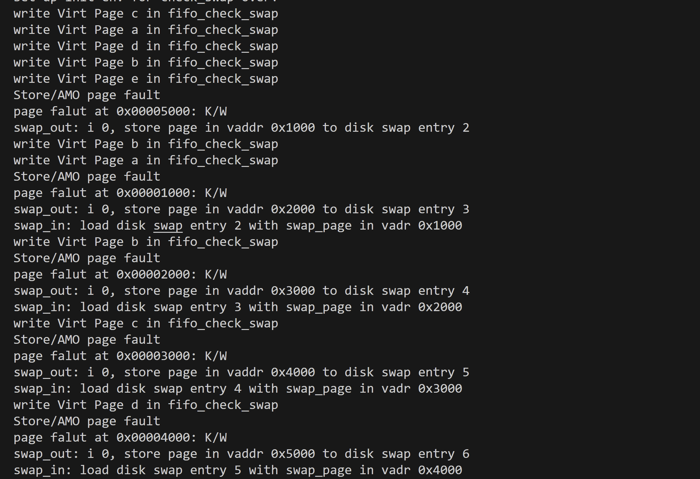

###Lab4
####练习1：分配并初始化一个进程控制块
#####实现过程
```C
static struct proc_struct *
alloc_proc(void) {
    struct proc_struct *proc = kmalloc(sizeof(struct proc_struct));
    if (proc != NULL) {
    
        proc->state = PROC_UNINIT;  //设置进程为未初始化状态
        proc->pid = -1;             //未初始化的的进程id为-1
        proc->runs = 0;             //初始化时间片
        proc->kstack = 0;           //内存栈的地址
        proc->need_resched = 0;     //是否需要调度设为不需要
        proc->parent = NULL;        //父节点设为空
        proc->mm = NULL;            //虚拟内存设为空
        memset(&(proc->context), 0, sizeof(struct context));//上下文的初始化
        proc->tf = NULL;            //中断帧指针置为空
        proc->cr3 = boot_cr3;       //页目录设为内核页目录表的基址
        proc->flags = 0;            //标志位
        memset(proc->name, 0, PROC_NAME_LEN);//进程名
    }
    return proc;
}
```
`alloc_proc`函数负责分配并返回一个新的`struct proc_struct`结构，用于存储新建立的内核线程的管理信息。下面详细分析每一个成员变量的初始化。
<ul>
  <li>在proc_struct结构体被初始化时，该进程的状态应该为未初始化状态，因此proc->state被置为PROC_UNINIT</li>
  <li>进程id(proc->pid)也由于未被初始化而被置为-1</li>
  <li>由于这是一个新的进程，其已经执行的时间片应该被置为0，即proc->runs = 0</li>
  <li>由于是新的进程，其内存栈的地址也被初始化为0</li>
  <li>当一个进程主动放弃CPU时，need_resched会被置为'1'表示需要调度，但是对于一个新进程而言，它还没有被初始化，通常不会占用CPU资源，也就不需要释放CPU资源，申请调度。因此初始化进程时的need_resched会被置为'0'</li>
  <li>对于一个新进程而言，一般会将其父节点置为空，而不是实际进程树上的父节点，因此proc->parent = NULL</li>
  <li>同理，存储虚拟内存的映射，虚存管理等信息的内存管理节点也会被置为空，即proc->mm = NULL</li>
  <li>对于初始化的进程，和其相关的寄存器还没有被该进程使用，因此需要初始化为0，即初始化上下文为0(memset(&(proc->context), 0, sizeof(struct context)))，其中，sizeof(struct context)表示内存块的大小</li>
  <li>对于需要被初始化的进程，其还没有被执行，因此其执行状态为空，因此保存其执行状态的中断帧会被置为空</li>
  <li>每个进程都有自己的页表，而对于新的进程，其页表基址被初始化为内核页目录表基址，即proc->cr3 = boot_cr3</li>
  <li>对于新进程，其各个字段的标志信息会被初始化为0，即proc->flags = 0</li>
  <li>最后，需要记录下进程的名称，即memset(proc->name, 0, PROC_NAME_LEN);</li>
</ul>

#####问题回答
**问题**  
**请说明proc_struct中struct context context和struct trapframe \*tf成员变量含义和在本实验中的作用是啥？(提示通过看代码和编程调试可以判断出来)**

在context这个结构体中：存储了进程的执行上下文，包括了函数调用栈的返回地址（ra），栈指针（sp），以及一系列通用寄存器的值（s0 到 s11）。这些寄存器状态在进程被中断或切换时会被保存，以便在后续恢复进程的执行状态。因此在进程`proc_struct`这个结构体中，**context结构体用于保存进程的执行上下文信息，包括寄存器状态和栈指针等**。

作用：当操作系统需要切换进程时，它会保存当前进程的执行上下文到这个结构体，然后加载下一个进程的执行上下文，从而实现进程的切换。这对于多任务操作系统非常关键，因为它允许操作系统保存和恢复进程的执行状态，以便正确切换和调度多个进程。

```C
struct trapframe {
    struct pushregs gpr;
    uintptr_t status;
    uintptr_t epc;
    uintptr_t tval;
    uintptr_t cause;
};
```
**struct pushregs gpr**是一个结构体，用于保存通用寄存器的值。通用寄存器通常包括一组用于存储数据和地址的寄存器。在这个结构体中，gpr 存储了这些通用寄存器的值。  

**uintptr_t statu**s是一个整数字段，表示中断或异常发生时的处理器状态。它包括处理器的各种标志位和控制信息。

**uintptr_t epc**是一个整数字段，表示中断或异常发生时的程序计数器（PC）的值。PC 指向下一条要执行的指令。

**uintptr_t tva**l是一个整数字段，表示中断或异常的特定值（trap value）。它通常包含了引发中断或异常的原因或导致异常的数据。

**uintptr_t cause**是一个整数字段，表示中断或异常的原因或类型。它包括了信息，指示了发生中断或异常的具体原因，如中断类型或异常类型。

**trapframe *tf**是一个指向陷阱帧（trap frame）的指针，用于存储当前中断或异常的信息。

作用：当进程遇到中断或异常时，处理器会自动将相关信息保存到陷阱帧中，然后将控制权转交给操作系统的中断处理程序。这个指针允许操作系统访问陷阱帧，以检测中断或异常的原因，并采取相应的措施，如保存进程状态、调度其他进程或处理错误。

####练习2：为新创建的内核线程分配资源
#####实现过程
```C
int
do_fork(uint32_t clone_flags, uintptr_t stack, struct trapframe *tf) {
    int ret = -E_NO_FREE_PROC;
    struct proc_struct *proc;
    if (nr_process >= MAX_PROCESS) {
        goto fork_out;
    }
    ret = -E_NO_MEM;
    //1：调用alloc_proc，首先获得一块用户信息块
    if ((proc = alloc_proc()) == NULL) {
        goto fork_out;
    }
    //2.将子进程的父节点设置为当前进程
    proc->parent = current;
    //3.调用setup_stack()函数为进程分配一个内核栈
    if (setup_kstack(proc) != 0) {
        goto bad_fork_cleanup_proc;
    }
    //4.调用copy_mm()函数复制原进程的内存管理信息到新进程
    if (copy_mm(clone_flags, proc) != 0) {
        goto bad_fork_cleanup_kstack;
    }
    //5.调用copy_thread()函数复制原进程上下文到新进程
    copy_thread(proc, stack, tf);
    //6.将新进程添加到进程列表
    bool intr_flag;
    local_intr_save(intr_flag);
    {
        proc->pid = get_pid();
        hash_proc(proc); //建立映射
        nr_process ++;  //进程数加1
        list_add(&proc_list, &(proc->list_link));//将进程加入到进程的链表中
    }
    local_intr_restore(intr_flag);
    //7.唤醒新进程
    wakeup_proc(proc);
    //8.返回新进程号
    ret = proc->pid;

fork_out:
    return ret;
bad_fork_cleanup_kstack:
    put_kstack(proc);
bad_fork_cleanup_proc:
    kfree(proc);
    goto fork_out;
}
```
操作系统内核中，利用kernel_thread()函数创建内核线程，在该函数中会调用do_fork()函数最终完成了内核线程的创建工作。接下来详细描述do_fork()函数中具体做了什么。
<ul>
    <li>首先声明了一个进程结构体变量proc，用于作为该函数的返回值，表示创建了一个新的进程。</li>
    <li>接下来首先判断当前系统中的进程数量是否已经达到最大值，如果已满则无法创建新进程返回错误码 -E_NO_FREE_PROC，表示没有可用的进程控制块</li>
    <strong>如果没有达到进程数量最大值，则正式进行进程的创建。</strong>
    <li>首先利用第一问中的<strong>alloc_proc()</strong>函数分配了一个新的进程块。如果分配正确的话，alloc_proc()函数会返回初始化好的进程结构体。因此首先判断alloc_proc()函数的返回值是否为空，不为空则证明分配正常，为空则返回错误码-E_NO_MEM，表示内存不够，无法为新进程分配所需的内存资源</li>
    <li><strong>proc->parent = current</strong>，将新创建的子进程的父节点设置为当前进程，用于完善系统中的进程树</li>
    <li>接下来调用<strong>setup_stack()</strong>函数为进程分配一个内核栈

```C
static int 
    setup_kstack(struct proc_struct *pro) 
    {
        struct Page *page = alloc_pages(KSTACKPAGE);
        if (page != NULL) {
            proc->kstack = (uintptr_t)page2kva(page);
            return 0;
        }
        return -E_NO_MEM;
    }
```
<ul>
    <li>在setup_kstack函数中，首先利用alloc_pages()函数为进程分配了大小为KSTACKPAGE的页</li>
    <li>接下来判断分配是否成功，如果成功则将该页面的虚拟地址赋值给进程中的kstack这个成员变量</li>
</ul>
<li>分配好内存栈后，调用<strong>copy_mm()</strong>函数复制原进程的内存管理信息到新进程</li>

```C
static int
copy_mm(uint32_t clone_flags, struct proc_struct *proc) {
    assert(current->mm == NULL);
    /* do nothing in this project */
    return 0;
}
```
<ul>
    <li>在copy_mm中，首先利用一个断言函数，判断当前结构体中的的内存管理信息是否为空，即判断该进程是否为刚刚初始化的进程。如果不是才需要做copy的操作</li>
    <li>由于在Lab4中并不做任何工作，因此copy_mm并不是先实质性的功能</li>
</ul>

<li>复制好远进程的内存管理信息到新进程后，调用<strong>copy_thread()</strong>函数复制原进程上下文(关键寄存器的值)到新进程</li>

```C
static void
copy_thread(struct proc_struct *proc, uintptr_t esp, struct trapframe *tf) {
    proc->tf = (struct trapframe *)(proc->kstack + KSTACKSIZE - sizeof(struct trapframe));
    *(proc->tf) = *tf;

    // Set a0 to 0 so a child process knows it's just forked
    proc->tf->gpr.a0 = 0;
    proc->tf->gpr.sp = (esp == 0) ? (uintptr_t)proc->tf : esp;

    proc->context.ra = (uintptr_t)forkret;
    proc->context.sp = (uintptr_t)(proc->tf);
}
```
<ul>
<li><strong>proc->tf = (struct trapframe *)(proc->kstack + KSTACKSIZE - sizeof(struct trapframe))</strong>
<br>
首先将 proc->tf 设置为内核栈（proc->kstack）的末尾，然后减去 struct trapframe 结构的大小，以便 proc->tf 指向栈中的一个位置，以便在该位置存储陷阱帧（tf）的副本
</li>
<li><strong>*(proc->tf) = *tf</strong>
<br>
将传递给函数的 tf 结构中的内容复制到 proc->tf 指向的位置，即将当前进程的上下文复制到新进程的内核栈中</li>
<li><strong>proc->tf->gpr.a0 = 0</strong>
<br>
将通用寄存器a0的值置为0，表示子进程知道自己是通过do_fork()函数创建的</li>
<li><strong>proc->tf->gpr.sp = (esp == 0) ? (uintptr_t)proc->tf : esp</strong>
<br>
如果传递给函数的 esp==0，则表示这是一个新创建的进程，那么栈指针被设置为新进程的内核栈顶，否则，它将设置为传递给函数的 esp 值。</li>
<li><strong>proc->context.ra = (uintptr_t)forkret</strong>
<br>
这行代码设置新进程的上下文（context）中的返回地址寄存器（ra）为forkret()函数的地址，表示在新进程执行完后应该返回到 forkret 函数。而forkret()函数返回的是forkrets()函数的值。forkrets 通常用于在操作系统内核中执行进程切换时，完成新进程创建的一些清理工作和恢复工作</li>
<li><strong>proc->context.sp = (uintptr_t)(proc->tf)</strong>
<br>
这行代码设置新进程的上下文中的栈指针（sp）为新进程的陷阱帧地址，以确保在新进程执行时使用正确的栈</li>
</ul>
<li>复制好上下文后，即可将新进程添加到进程列表</li>

```C
bool intr_flag;
local_intr_save(intr_flag);
{
    proc->pid = get_pid();
    hash_proc(proc); //建立映射
    nr_process ++;  //进程数加1
    list_add(&proc_list, &(proc->list_link));//将进程加入到进程的链表中
}
local_intr_restore(intr_flag);
```
<ul>
<li>首先通过get_pid()函数获取新进程对应的唯一进程ID，并将其分配给proc结构体中的pid成员,即proc->pid=get_pid();</li>
<li>然后通过hash_proc()函数建立进程 proc 和其PID之间的映射关系</li>
<li>nr_process++增加了进程计数器nr_process的值，表示当前系统中的进程数多了1。</li>
<li>最后，list_add(&proc_list, &(proc->list_link));：将新创建的进程 proc 添加到一个进程链表中，以便内核可以维护并管理所有进程。</li>
<strong>local_intr_save(x)这个宏用于保存当前的中断状态，并将其存储在变量 x 中；而local_intr_restore(x)这个宏用于在后续的代码中恢复之前保存的中断状态。</strong>
</ul>
<li>最后，需要唤醒新的进程：<strong>wakeup_proc(proc)</strong>，并返回新的进程号码<strong>ret = proc->pid</strong></li>

```C
bad_fork_cleanup_kstack:
    put_kstack(proc);
bad_fork_cleanup_proc:
    kfree(proc);
```
<li>上述两个函数用于清理和释放资源的标签或标号。
<br>
其中<strong>bad_fork_cleanup_kstack：put_kstack(proc)</strong>这行代码调用了put_kstack函数，用于释放进程 proc 的内核栈
<br>
<strong>bad_fork_cleanup_proc：kfree(proc)</strong>这行代码调用了kfree函数，用于释放进程 proc 占用的内存资源。</li>
</ul>

#####问题回答
**问题**
**请说明ucore是否做到给每个新fork的线程一个唯一的id？请说明你的分析和理由。**

ucore通过get_pid()函数为每个进程分配一个进程id，下面详细分析get_pid()函数
```C
static int
get_pid(void) {
    static_assert(MAX_PID > MAX_PROCESS);
    struct proc_struct *proc;
    list_entry_t *list = &proc_list, *le;
    static int next_safe = MAX_PID, last_pid = MAX_PID;
    if (++ last_pid >= MAX_PID) {
        last_pid = 1;
        goto inside;
    }
    if (last_pid >= next_safe) {
    inside:
        next_safe = MAX_PID;
    repeat:
        le = list;
        while ((le = list_next(le)) != list) {
            proc = le2proc(le, list_link);
            if (proc->pid == last_pid) {
                if (++ last_pid >= next_safe) {
                    if (last_pid >= MAX_PID) {
                        last_pid = 1;
                    }
                    next_safe = MAX_PID;
                    goto repeat;
                }
            }
            else if (proc->pid > last_pid && next_safe > proc->pid) {
                next_safe = proc->pid;
            }
        }
    }
    return last_pid;
}
```
<ul>
<li><strong>static_assert(MAX_PID > MAX_PROCESS)</strong>是一个静态断言，用来确保MAX_PID大于MAX_PROCESS，以确保PID的范围可以包含所有可能的进程。</li>

<li><strong>struct proc_struct *proc</strong>声明了一个名为proc的结构体指针，但未初始化。</li>

<li><strong>list_entry_t *list = &proc_list, *le;</strong>声明了一个名为list的指针，它指向一个链表头（proc_list），以及名为le的链表条目指针。</li>

<li><strong>static int next_safe = MAX_PID, last_pid = MAX_PID;</strong>声明了两个静态整数，next_safe初始化为MAX_PID，last_pid也初始化为MAX_PID。
<br>
<strong>next_safe</strong>在函数中用来跟踪安全的（可用的）PID 值的变量，初始化为MAX_PID表示所有的 PID 值都可以视为安全的，即还没有被分配给任何进程。
<br>
同时，在代码中next_safe的值随着pid的分配而不断变化，这可以帮助跳过那些已经被分配给进程的 PID 值，从而加快查找唯一 PID 的速度。
<strong>last_pid</strong>用于跟踪当前分配给进程的最后一个 PID 值。它在这个函数中的作用是<strong>确保每个进程都获得一个唯一的 PID</strong></li>


<li><strong>if (++last_pid >= MAX_PID)</strong> 是一个条件语句，用来检查last_pid是否超过了MAX_PID。如果超过，last_pid被重置为1，然后跳到inside标签。</strong></li>

<li><strong>if (last_pid >= next_safe)</strong>是另一个条件语句，用来检查last_pid是否大于等于next_safe。如果是这样，也跳到inside标签。</li>

<li><strong>inside</strong>是一个标签，用来标识代码块的入口。</li>

<li><strong>next_safe = MAX_PID</strong>在inside标签下，next_safe被重置为MAX_PID。</li>

<li><strong>repeat</strong>是另一个标签，用于标识循环的起始点。</li>

<li><strong>le = list</strong>初始化le为list，以便在链表上进行迭代。</li>

<li><strong>while ((le = list_next(le)) != list)</strong>循环用来遍历链表中的所有进程。</li>

<li><strong>proc = le2proc(le, list_link)</strong>将链表条目le转换为进程结构体proc。</li>

<li><strong>if (proc->pid == last_pid)</strong>表示如果进程的PID等于last_pid，则增加last_pid的值，以确保它是唯一的。

<li><strong>else if (proc->pid > last_pid && next_safe > proc->pid)</strong>进一步，如果进程的PID大于last_pid，并且比next_safe小，更新next_safe以确保下一个PID是唯一的。</li>

<li><strong>return last_pid</strong>最后返回最终确定的唯一PID。</li>

</ul>

**总的来说，函数首先从last_pid开始，逐个增加PID值，然后在链表中查找是否有进程已经使用了这个PID。如果有，就增加PID值，直到找到一个尚未被使用的唯一PID。通过递增last_pid，更改next_safe追踪可用的PID范围，并在必要时通过next_safe来跳过已经分配的PID，提高效率，从而保证了给每一个新线程一个唯一的id。**

####练习3：编写proc_run 函数
#####proc_run函数
```C
void
proc_run(struct proc_struct *proc) {
    if (proc != current) {
        bool intr_flag;
        struct proc_struct *prev = current, *next = proc;
        local_intr_save(intr_flag);
        {
            current = proc; 
            uintptr_t new_sp = (uintptr_t)(next->kstack + KSTACKSIZE);
            asm volatile("mv sp, %0" : : "r"(new_sp));
            lcr3(next->cr3);
            switch_to(&(prev->context), &(next->context));
        }
        local_intr_restore(intr_flag);
    }
}
```
首先检查要切换的进程是否与当前正在运行的进程相同，如果相同则不需要切换，利用if(proc!=current)进行判断，如果**不同**则进行接下来的进程切换操作。
<ul>
<li>首先定义了一个布尔变量intr_flag，用于保存当前的中断状态。</li>
<li>紧接着定义变量prev保存当前运行的进程，而变量next保存了要切换到的新进程。</li>
<li>local_intr_save(intr_flag) 用于保存当前中断状态并关闭中断，以防止在进程切换过程中发生中断。</li>
<li>接下来在临界区内，首先将current设置为新的进程 proc，表示要运行这个新的进程。</li>
<li>计算new_sp，这是新进程的栈指针。它使用新进程的内核栈（kstack）并加上 KSTACKSIZE 来计算。因为内核栈通常是由<strong>低地址向高地址增长</strong>的，所以将栈指针设置为栈的顶部。</li>
<li>使用内联汇编（asm volatile）将栈指针寄存器 sp 设置为new_sp的值，从而切换到新的内核栈。</li>
<li>使用 lcr3(next->cr3) 来切换页表，将CR3寄存器设置为新进程的页目录表地址，以确保新进程在其自己的地址空间运行。</li>
<li>调用 switch_to(&(prev->context), &(next->context))来执行实际的进程切换。这个函数切换了进程的上下文，包括寄存器、栈指针和程序计数器等，从而使新进程开始执行。</li>
<li>最后，在退出临界区后，使用 local_intr_restore(intr_flag) 恢复中断状态，以允许中断重新启用。</li>
</ul>

#####问题回答
**问题**
**在本实验的执行过程中，创建且运行了几个内核线程？**

在本次实验中，一共创建了两个内核线程，分别为**idleproc**和**initproc**。

**idleproc**是一个空闲进程，它的主要目的是在系统没有其他任务需要执行时，占用 CPU 时间，同时便于进程调度的统一化。在本实验中，它的主要工作是完成内核中各个子系统的初始化。

而**initproc**是idleproc内核子线程自己不想完成各种其他工作，调用kernel_thread函数创建的一个内核线程init_main，在本次实验中只做输出一些字符串的工作。


####扩展练习 Challenge：
**说明语句local_intr_save(intr_flag);....local_intr_restore(intr_flag);是如何实现开关中断的？**

**local_intr_save(intr_flag)**   
该函数的目的是保存当前中断状态，并且禁用中断。在多任务操作系统中，需要保证临界区的代码在执行时不会被中断打断，以防止竞争条件。因此，此函数的作用是禁用中断，并将当前中断状态保存在 intr_flag 变量中。下面进行详细分析：

```C
#define local_intr_save(intr_flag) 
do {                   
    x = __intr_save(); 
} while (0)
```
local_intr_save(intr_flag)是一个宏，用于保存当前中断状态并禁用中断。宏接受一个参数intr_flag，它是用于保存当前中断状态的变量。  
x = __intr_save();调用了一个函数 __intr_save() 并将其返回值赋给变量 x。函数 __intr_save() 的作用是保存当前中断状态并禁用中断。
```C
static inline bool __intr_save(void) {
    if (read_csr(sstatus) & SSTATUS_SIE) {
        intr_disable();
        return 1;
    }
    return 0;
}
```
static inline bool __intr_save(void)是一个静态内联函数，用于保存当前中断状态并禁用中断，然后返回一个布尔值，指示中断是否已被禁用。其中
<ul>
<li>if (read_csr(sstatus) & SSTATUS_SIE)使用 RISC-V 的 CSR（Control and Status Register）机制来读取 sstatus 寄存器的值，并检查其中的 SIE（Supervisor Interrupt Enable）位是否被设置。SIE 位用于控制中断是否允许。如果 SIE 位被设置，表示中断是允许的。</li

<li>intr_disable():如果中断允许（SIE 位被设置），则调用 intr_disable() 函数来禁用中断。这将清除 sstatus 寄存器中的 SIE 位，从而禁止中断。</li>

<li>return 1:如果中断允许，并且已被禁用，函数返回 1，表示中断已经被保存和禁用。</li>

<li>return 0:如果中断未被允许，函数返回0，表示中断没有被保存和禁用。</li>
</ul>

**这里采用do while结构可以有效解决宏定义中没有终止符可能造成的语法错误。**

**local_intr_restore(intr_flag)**  
该函数的目的是在临界区的代码执行完成后，恢复之前保存的中断状态。下面进行详细分析：

```C
#define local_intr_restore(intr_flag) __intr_restore(x);
```
local_intr_restore(intr_flag)是一个宏定义，用于恢复之前保存的中断状态。宏接受一个参数 intr_flag，这个参数通常是之前由 local_intr_save 宏保存的中断状态。  
__intr_restore(x);: 这一行代码调用了一个函数 __intr_restore(x)，其中 x 是之前保存的中断状态。

```C
static inline void __intr_restore(bool flag) {
    if (flag) {
        intr_enable();
    }
}
```
__intr_restore()是一个静态内联函数，用于根据传递的标志flag来恢复之前保存的中断状态。
<ul>
<li>if (flag)首先检查传递的标志 flag，如果该标志为真（即之前中断被保存和禁用），则继续执行下面的操作。</li>

<li>intr_enable(): 如果标志 flag 为真，表示之前中断是被保存和禁用的，那么函数调用 intr_enable() 来重新启用中断。这将设置 sstatus 寄存器中的 SIE 位，从而允许中断响应。</li>
</ul>

####实验总结
通过本次实验了解了内核线程的建立和执行过程，内核线程是一种特殊的进程，其与用户进程主要有两个区别。本次实验首先需要创建第0个内核线程idleproc，它的任务是调用proc_init函数初始化进程控制块，其中包含内核线程的管理信息。其次内核线程idleproc通过调用kernel_thread函数创建了一个内核线程init_main，然后由此线程来创建其他的线程或用户进程。最后需要执行创建好的initproc内核线程。 


####运行结果展示
#####make qemu





#####make grade
