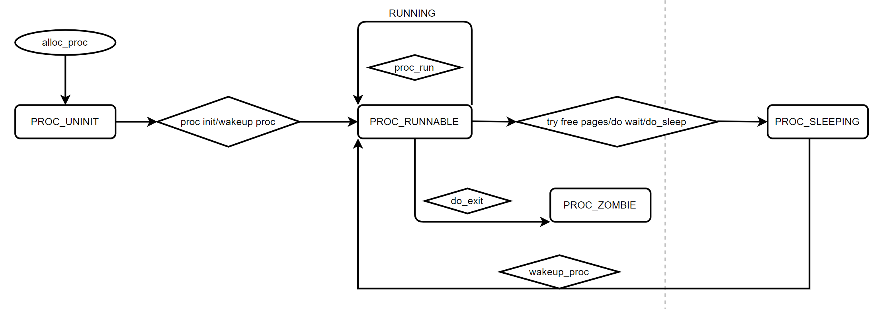
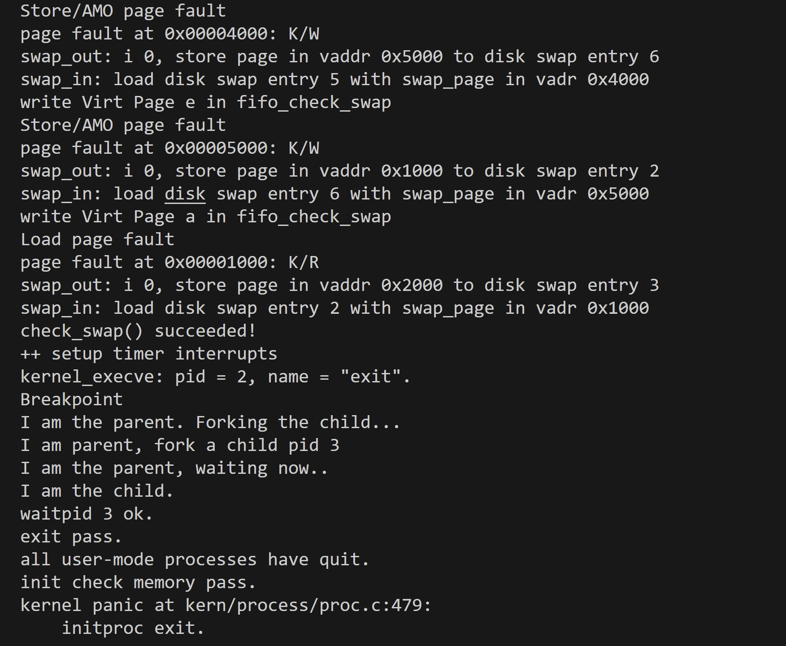
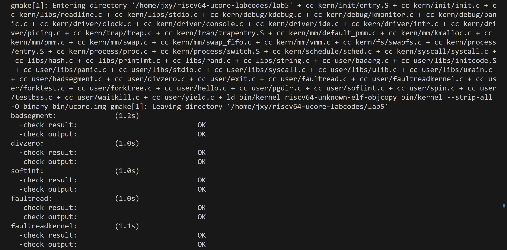
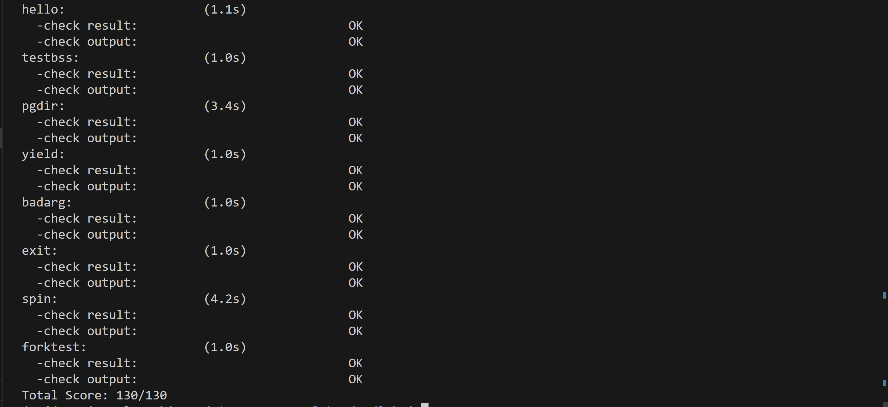

###Lab5
####练习0：填写已有实验
#####proc.c
1. 和Lab4相比，Lab5中的alloc_proc()函数需要添加两行代码
```C
proc->wait_state = 0;		//初始化进程等待状态
proc->cptr = proc->optr = proc->yptr = NULL;		//进程相关指针初始化
```
这里主要涉及进程相关指针的初始化，具体描述如下：
```C
parent:           proc->parent  (proc is children)
children:         proc->cptr    (proc is parent)
older sibling:    proc->optr    (proc is younger sibling)
younger sibling:  proc->yptr    (proc is older sibling)
```

2. 同时还要修改do_fork函数，主要添加两处代码
```C
assert(current->wait_state == 0);	//确保当前进程正在等待
set_links(proc);					//将原来简单的计数改成来执行set_links函数，从而实现设置进程的相关链接 
```
该函数将会在练习3中进行详细分析，这里不详细展开了。

####练习1：加载应用程序并执行(load_icode)
#####实现过程
`do_execve()`函数，作用是先收回进程自身所占用的用户空间，然后调用`load_icode()`函数，用新的程序覆盖内存空间，形成一个执行新程序的新进程。`load_icode()`函数被调用之后，完成加载放在内存中的执行程序进程空间，涉及到页表等的修改，分配用户空间。

下面对`load_icode()`函数进行分析

1. 首先调用 `mm_create` 函数来申请进程的内存管理数据结构 mm 所需内存空间,并对 mm 进行初始化
```C
//(1) create a new mm for current process
if ((mm = mm_create()) == NULL) 
{
    goto bad_mm;
}
```
2. 调用 `setup_pgdir`来申请一个页目录表所需的一个页大小的内存空间,并把描述ucore内核虚空间映射的内核页表(`boot_pgdir`所指)的内容拷贝到此新目录表中,最后让`mm->pgdir`指向此页目录表,这就是进程新的页目录表了,且能够正确映射内核虚空间
```C
//(2) create a new PDT, and mm->pgdir= kernel virtual addr of PDT
if (setup_pgdir(mm) != 0) 
{
    goto bad_pgdir_cleanup_mm;
}
```
3. 根据可执行程序的起始位置来解析此 ELF 格式的执行程序，并调用 mm_map函数根据 ELF格式执行程序的各个段(代码段、数据段、BSS段等)的起始位置和大小建立对应的vma结构，并把vma 插入到 mm结构中，表明这些是用户进程的合法用户态虚拟地址空间。主要分为以下6步

- 声明了一个名为Page的结构和指向elfhdr和proghdr结构的指针elf和ph。
```C
//(3) copy TEXT/DATA section, build BSS parts in binary to memory space of process
struct Page *page;
//(3.1) get the file header of the bianry program (ELF format)
struct elfhdr *elf = (struct elfhdr *)binary;
//(3.2) get the entry of the program section headers of the bianry program (ELF format)
struct proghdr *ph = (struct proghdr *)(binary + elf->e_phoff);
```
- 接下来检查ELF头中的魔数是否有效。如果无效，则返回错误。
```C
//(3.3) This program is valid?
if (elf->e_magic != ELF_MAGIC) 
{
    ret = -E_INVAL_ELF;
    goto bad_elf_cleanup_pgdir;
}
uint32_t vm_flags, perm;
struct proghdr *ph_end = ph + elf->e_phnum;
```
- 循环遍历ELF文件中的每个程序头。跳过非ELF_PT_LOAD类型的程序头。检查程序段的文件大小是否大于或等于内存大小，如果不是，则返回错误。
```C
for (; ph < ph_end; ph ++) 
{//(3.4) find every program section headers
    if (ph->p_type != ELF_PT_LOAD) 
    {
        continue ;
    }
    if (ph->p_filesz > ph->p_memsz) 
    {
        ret = -E_INVAL_ELF;
        goto bad_cleanup_mmap;
    }
    if (ph->p_filesz == 0) {
        // continue ;
    }
}
```
- 根据程序头的属性调整虚拟内存标志，并调用 mm_map 函数设置新的虚拟内存区域（VMA）。
```C
//(3.5) call mm_map fun to setup the new vma ( ph->p_va, ph->p_memsz)
vm_flags = 0, perm = PTE_U | PTE_V;
if (ph->p_flags & ELF_PF_X) vm_flags |= VM_EXEC;
if (ph->p_flags & ELF_PF_W) vm_flags |= VM_WRITE;
if (ph->p_flags & ELF_PF_R) vm_flags |= VM_READ;
// modify the perm bits here for RISC-V
if (vm_flags & VM_READ) perm |= PTE_R;
if (vm_flags & VM_WRITE) perm |= (PTE_W | PTE_R);
if (vm_flags & VM_EXEC) perm |= PTE_X;
if ((ret = mm_map(mm, ph->p_va, ph->p_memsz, vm_flags, NULL)) != 0) 
{
    goto bad_cleanup_mmap;
}
unsigned char *from = binary + ph->p_offset;
size_t off, size;
uintptr_t start = ph->p_va, end, la = ROUNDDOWN(start, PGSIZE);

ret = -E_NO_MEM;
```
- 遍历程序段的每一页，分配内存，并将二进制程序中的内容复制到进程的内存中
```C
 //(3.6) alloc memory, and  copy the contents of every program section (from, from+end) to process's memory (la, la+end)
end = ph->p_va + ph->p_filesz;
//(3.6.1) copy TEXT/DATA section of bianry program
while (start < end) 
{
    if ((page = pgdir_alloc_page(mm->pgdir, la, perm)) == NULL) 
    {
        goto bad_cleanup_mmap;
    }
    off = start - la, size = PGSIZE - off, la += PGSIZE;
    if (end < la) 
    {
        size -= la - end;
    }
    memcpy(page2kva(page) + off, from, size);
    start += size, from += size;
}
```
- 构建二进制程序的BSS段，分配内存并将其初始化为零。
```C
//(3.6.2) build BSS section of binary program
end = ph->p_va + ph->p_memsz;
if (start < la) 
{
    /* ph->p_memsz == ph->p_filesz */
    if (start == end)
    {
        continue ;
    }
    off = start + PGSIZE - la, size = PGSIZE - off;
    if (end < la) {
        size -= la - end;
    }
    memset(page2kva(page) + off, 0, size);
    start += size;
    assert((end < la && start == end) || (end >= la && start == la));
}
while (start < end) 
{
    if ((page = pgdir_alloc_page(mm->pgdir, la, perm)) == NULL) 
    {
        goto bad_cleanup_mmap;
    }
    off = start - la, size = PGSIZE - off, la += PGSIZE;
    if (end < la) 
    {
        size -= la - end;
    }
    memset(page2kva(page) + off, 0, size);
    start += size;
}
```
**总的来说，第三步完成了以下工作：  调用`mm_map`函数根据解析的结果（包括代码段、数据段、BSS段的起始位置和大小）建立对应的`vma`结构，并把`vma`插入到`mm`结构中，从而表明了用户进程的合法用户态虚拟地址空间。调用根据执行程序各个段的大小分配物理内存空间，并根据执行程序各个段的起始位置 确定虚拟地址，并在页表中建立好物理地址和虚拟地址的映射关系，然后把执行程序各 个段的内容拷贝到相应的内核虚拟地址中，至此应用程序执行码和数据已经根据编译时 设定地址放置到虚拟内存中了。**

4. 需要给用户进程设置用户栈,为此调用 mm_mmap 函数建立用户栈的 vma 结构,明确用户栈的位置在用户虚空间的顶端,大小为 256 个页,即1MB,并分配一定数量的物理内存且建立好栈的虚地址<-->物理地址映射关系
```C
//(4) build user stack memory
vm_flags = VM_READ | VM_WRITE | VM_STACK;
if ((ret = mm_map(mm, USTACKTOP - USTACKSIZE, USTACKSIZE, vm_flags, NULL)) != 0) 
{
    goto bad_cleanup_mmap;
}
assert(pgdir_alloc_page(mm->pgdir, USTACKTOP-PGSIZE , PTE_USER) != NULL);
assert(pgdir_alloc_page(mm->pgdir, USTACKTOP-2*PGSIZE , PTE_USER) != NULL);
assert(pgdir_alloc_page(mm->pgdir, USTACKTOP-3*PGSIZE , PTE_USER) != NULL);
assert(pgdir_alloc_page(mm->pgdir, USTACKTOP-4*PGSIZE , PTE_USER) != NULL);
```
5. 至此,进程内的内存管理 vma 和 mm 数据结构已经建立完成,于是把 mm->pgdir 赋值到 cr3 寄存器中,即更新了用户进程的虚拟内存空间,此时的 init 已经被 exit 的代码和数据覆盖,成为了第一个用户进程,但此时这个用户进程的执行现场还没建立好
```C
//(5) set current process's mm, sr3, and set CR3 reg = physical addr of Page Directory
mm_count_inc(mm);
current->mm = mm;
current->cr3 = PADDR(mm->pgdir);
lcr3(PADDR(mm->pgdir));
```
6. 为用户环境设置中断帧，首先清空中断帧，然后重新设置，使得在执行中断以后，可以让CPU转到用户态特权级，并回到用户态内存空间，使用用户态的代码段、数据段和堆栈，且能够跳转到用户进程的第一条指令执行，并确保在用户态能够响应中断；这里`gpr.sp`保存的是用户栈顶，`epc`保存的是发生中断时的入口地址，`status`保存的是中断前的状态，`SPP`是权限模式，`SPIE`是之前的`SIE`值。
```C
//(6) setup trapframe for user environment
struct trapframe *tf = current->tf;
// Keep sstatus
uintptr_t sstatus = tf->status;
memset(tf, 0, sizeof(struct trapframe));
tf->gpr.sp = USTACKTOP; // 用户栈的栈顶
tf->epc = elf->e_entry; // 用户程序的入口地址
tf->status = sstatus & ~(SSTATUS_SPP | SSTATUS_SPIE); // 设置适用于用户程序的 SSTATUS

ret = 0;
```
#####问题回答
**问题**  
**请简要描述这个用户态进程被ucore选择占用CPU执行（RUNNING态）到具体执行应用程序第一条指令的整个经过。**
- 首先会调用schedule函数，调度器占用了CPU的资源之后，用户态进程调用了exec系统调用，从而转入到了系统调用的处理例程
- 之后进行正常的中断处理，然后控制权转移到了user/libs/syscall.c中的syscall函数，然后根据系统调用号转移给了syscall/syscall.c中的sys_exec函数；
- 在该函数中调用了do_execve函数来完成指定应用程序的加载；在该函数中同时调用load_icode读入程序的数据段和代码段
- 该函数最后修改栈帧，使其可以在中断返回后切换到用户态
- 逐步返回，最后iret，恢复栈帧后程序开始运行
- 首先进入initcode.S，将ebp设为0，esp减小(用于printstackframe)
- 调用umain
- umain中调用main()函数，开始执行程序


####练习2：父进程复制自己的内存空间给子进程(`copy_range`)
#####实现过程

将父进程的内存空间复制给子进程大致需要三步：首先是使用page2kva函数返回父进程和子进程的内核虚拟页地址，然后直接使用memcpy将父进程的地址贴给子进程，最后使用page_insert函数建立子进程页地址起始位置与物理地址的映射关系。如以下代码，在copy_range函数中添加这几句即可实现复制过程。
```C
int copy_range(pde_t *to, pde_t *from, uintptr_t start, uintptr_t end,
               bool share) {
    assert(start % PGSIZE == 0 && end % PGSIZE == 0);
    assert(USER_ACCESS(start, end));
    // copy content by page unit.
    do {
        // call get_pte to find process A's pte according to the addr start
        pte_t *ptep = get_pte(from, start, 0), *nptep;
        if (ptep == NULL) {
            start = ROUNDDOWN(start + PTSIZE, PTSIZE);
            continue;
        }
        // call get_pte to find process B's pte according to the addr start. If
        // pte is NULL, just alloc a PT
        if (*ptep & PTE_V) {
            if ((nptep = get_pte(to, start, 1)) == NULL) {
                return -E_NO_MEM;
            }
            uint32_t perm = (*ptep & PTE_USER);
            // get page from ptep
            struct Page *page = pte2page(*ptep);
            // alloc a page for process B
            struct Page *npage = alloc_page();
            assert(page != NULL);
            assert(npage != NULL);
            int ret = 0;
        
            void * kva_src = page2kva(page);			//返回父进程的内核虚拟页地址  
	        void * kva_dst = page2kva(npage);			//返回子进程的内核虚拟页地址  
 	        memcpy(kva_dst, kva_src, PGSIZE);			//复制父进程到子进程  
	        ret = page_insert(to, npage, start, perm);	//建立子进程页地址起始位置与物理地址的映射关系(prem是权限) 
            assert(ret == 0);
        }
        start += PGSIZE;
    } while (start != 0 && start < end);
    return 0;
}
```
#####问题回答
**问题**  
**如何设计实现Copy on Write机制？给出概要设计，鼓励给出详细设计**

- 在do_fork时不进行内存复制，只将对应内存页的页目录项中的R/W Bit设为只读
- 一旦发生写操作，就会引发page fault
-  在中断处理程序中恢复内存页的R/W状态
- 进行程序代码段、数据段的复制
- 返回继续执行


####练习3：阅读分析源代码，理解进程执行 fork/exec/wait/exit 的实现，以及系统调用的实现
#####对fork/exec/wait/exit函数的分析
1. fork  
当程序执行fork时，fork使用了系统调用SYS_fork,而系统调用SYS_fork则主要是由do_fork和wakeup_proc来完成的。do_fork函数代码如下
```C
do_fork(uint32_t clone_flags, uintptr_t stack, struct trapframe *tf) {
    int ret = -E_NO_FREE_PROC;
    struct proc_struct *proc;
    if (nr_process >= MAX_PROCESS) {
        goto fork_out;
    }
    ret = -E_NO_MEM;
    
    //1：调用alloc_proc()函数申请内存块，如果失败，直接返回处理
    if ((proc = alloc_proc()) == NULL) {
        goto fork_out;
    }
    //2.将子进程的父节点设置为当前进程
    proc->parent = current;
	assert(current->wait_state == 0);	
    //3.调用setup_stack()函数为进程分配一个内核栈
    if (setup_kstack(proc) != 0) {
        goto bad_fork_cleanup_proc;
    }
    //4.调用copy_mm()函数复制父进程的内存信息到子进程
    if (copy_mm(clone_flags, proc) != 0) {
        goto bad_fork_cleanup_kstack;
    }
    //5.调用copy_thread()函数复制父进程的中断帧和上下文信息
    copy_thread(proc, stack, tf);
    //6.将新进程添加到进程的hash列表中
    bool intr_flag;
    local_intr_save(intr_flag);
    {
        proc->pid = get_pid();
        hash_proc(proc); //建立映射
        set_links(proc);
    }
    local_intr_restore(intr_flag);
    //      7.一切就绪，唤醒子进程
    wakeup_proc(proc);
    //      8.返回子进程的pid
    ret = proc->pid;
 
fork_out:
    return ret;

bad_fork_cleanup_kstack:
    put_kstack(proc);
bad_fork_cleanup_proc:
    kfree(proc);
    goto fork_out;
}
```
和Lab4相比，Lab5中对do_fork函数增加了两处代码，分别为
```C
assert(current->wait_state == 0);	//确保当前进程正在等待
```
添加这一处代码为了保证在切换子进程的时候当前进程已经进入了等待状态。
```C
set_links(proc);					//将原来简单的计数改成来执行set_links函数，从而实现设置进程的相关链接 
```
这一处代码可以实现将简单的进程数加法换成调用执行set_links函数完成进程的相关链接。

总的来说，fork进程大体做了以下的工作:

- 分配并初始化进程控制块(alloc_proc 函数，注意这里可能是内核空间，也可能是用户空间);
- 分配并初始化内核栈(setup_stack 函数，有可能是内核中的栈，也有可能是用户栈);
- 根据 clone_flag标志复制或共享进程内存管理结构(copy_mm 函数);
- 设置进程在内核(也包括用户态)正常运行和调度所需的中断帧和执行上下文(copy_thread 函数);
- 把设置好的进程控制块放入hash_list 和 proc_list 两个全局进程链表中;
- 自此,进程已经准备好执行了,把进程状态设置为“就绪”态;
- 设置返回码为子进程的 id 号。
 
2. exec  
当应用程序执行的时候,会调用 SYS_exec 系统调用,而当ucore收到此系统调用的时候,则会使用 do_execve() 函数来实现,函数主要完成用户进程的创建工作,同时使用户进程进入执行。do_execve函数代码如下：
```C
int
do_execve(const char *name, size_t len, unsigned char *binary, size_t size) {
    struct mm_struct *mm = current->mm;
    if (!user_mem_check(mm, (uintptr_t)name, len, 0)) {
        return -E_INVAL;
    }
    if (len > PROC_NAME_LEN) {
        len = PROC_NAME_LEN;
    }

    char local_name[PROC_NAME_LEN + 1];
    memset(local_name, 0, sizeof(local_name));
    memcpy(local_name, name, len);

    if (mm != NULL) {
        cputs("mm != NULL");
        lcr3(boot_cr3);
        if (mm_count_dec(mm) == 0) {
            exit_mmap(mm);
            put_pgdir(mm);
            mm_destroy(mm);
        }
        current->mm = NULL;
    }
    int ret;
    if ((ret = load_icode(binary, size)) != 0) {
        goto execve_exit;
    }
    set_proc_name(current, local_name);
    return 0;

execve_exit:
    do_exit(ret);
    panic("already exit: %e.\n", ret);
}
```
总结exec进程主要工作如下:

- 首先为加载新的执行码做好用户态内存空间清空准备。
  
  - 如果mm不为NULL,则设置页表为内核空间页表,且进一步判断mm的引用计数减1后是否为0
  
    - 如果为0,则表明没有进程再需要此进程所占用的内存空间,为此将根据mm中的记录,释放进程所占用户空间内存和进程页表本身所占空间。
    - 最后把当前进程的mm内存管理指针为空。
    - 由于此处的initproc是内核线程,所以mm为NULL,整个处理都不会做。

- 接下来的一步是加载应用程序执行码到当前进程的新创建的用户态虚拟空间中。这里涉及到读ELF格式的文件,申请内存空间,建立用户态虚存空间,加载应用程序执行码等。 load_icode函数完成了整个复杂的工作。load_icode代码已经在练习1中详细介绍过
- 最后do_execve函数会调用`do_exit`函数来实现进程的退出、资源的释放。

3. wait  
当执行wait功能的时候，会调用系统调用SYS_wait，而该系统调用的功能则主要由do_wait函数实现，主要工作就是父进程如何完成对子进程的最后回收工作，do_wait函数代码如下：
```C
int
do_wait(int pid, int *code_store) {
    struct mm_struct *mm = current->mm;
    if (code_store != NULL) {
        if (!user_mem_check(mm, (uintptr_t)code_store, sizeof(int), 1)) {
            return -E_INVAL;
        }
    }

    struct proc_struct *proc;
    bool intr_flag, haskid;
repeat:
    haskid = 0;
    if (pid != 0) {
        proc = find_proc(pid);
        if (proc != NULL && proc->parent == current) {
            haskid = 1;
            if (proc->state == PROC_ZOMBIE) {
                goto found;
            }
        }
    }
    else {
        proc = current->cptr;
        for (; proc != NULL; proc = proc->optr) {
            haskid = 1;
            if (proc->state == PROC_ZOMBIE) {
                goto found;
            }
        }
    }
    if (haskid) {
        current->state = PROC_SLEEPING;
        current->wait_state = WT_CHILD;
        schedule();
        if (current->flags & PF_EXITING) {
            do_exit(-E_KILLED);
        }
        goto repeat;
    }
    return -E_BAD_PROC;

found:
    if (proc == idleproc || proc == initproc) {
        panic("wait idleproc or initproc.\n");
    }
    if (code_store != NULL) {
        *code_store = proc->exit_code;
    }
    local_intr_save(intr_flag);
    {
        unhash_proc(proc);
        remove_links(proc);
    }
    local_intr_restore(intr_flag);
    put_kstack(proc);
    kfree(proc);
    return 0;
}
```
总结wait进程主要工作如下:
- 如果 `pid!=0`，表示只找一个进程 id 号为 pid 的退出状态的子进程，否则找任意一个处于退出状态的子进程;
- 如果此子进程的执行状态不为`PROC_ZOMBIE`，表明此子进程还没有退出，则当前进程设置执行状态为`PROC_SLEEPING`，睡眠原因为`WT_CHILD`(即等待子进程退出)，调用`schedule()`函数选择新的进程执行，自己睡眠等待，如果被唤醒，则重复跳回步骤 1 处执行;
- 如果此子进程的执行状态为 `PROC_ZOMBIE`，表明此子进程处于退出状态，需要当前进程(即子进程的父进程)完成对子进程的最终回收工作，即首先把子进程控制块从两个进程队列`proc_list`和`hash_list`中删除，并释放子进程的内核堆栈和进程控制块。自此，子进程才彻底地结束了它的执行过程，它所占用的所有资源均已释放。

4. exit  
当执行exit功能的时候，会调用系统调用SYS_exit，而该系统调用的功能主要是由do_exit函数实现。do_exit函数如下
```C
int
do_exit(int error_code) {
    if (current == idleproc) {
        panic("idleproc exit.\n");
    }
    if (current == initproc) {
        panic("initproc exit.\n");
    }
    struct mm_struct *mm = current->mm;
    if (mm != NULL) {
        lcr3(boot_cr3);
        if (mm_count_dec(mm) == 0) {
            exit_mmap(mm);
            put_pgdir(mm);
            mm_destroy(mm);
        }
        current->mm = NULL;
    }
    current->state = PROC_ZOMBIE;
    current->exit_code = error_code;
    bool intr_flag;
    struct proc_struct *proc;
    local_intr_save(intr_flag);
    {
        proc = current->parent;
        if (proc->wait_state == WT_CHILD) {
            wakeup_proc(proc);
        }
        while (current->cptr != NULL) {
            proc = current->cptr;
            current->cptr = proc->optr;
    
            proc->yptr = NULL;
            if ((proc->optr = initproc->cptr) != NULL) {
                initproc->cptr->yptr = proc;
            }
            proc->parent = initproc;
            initproc->cptr = proc;
            if (proc->state == PROC_ZOMBIE) {
                if (initproc->wait_state == WT_CHILD) {
                    wakeup_proc(initproc);
                }
            }
        }
    }
    local_intr_restore(intr_flag);
    schedule();
    panic("do_exit will not return!! %d.\n", current->pid);
}
```
具体过程如下：

- 首先判断是否是用户进程，如果为内核线程则不需要回收空间；如果是用户进程，则开始回收此用户进程所占用的用户态虚拟内存空间。主要执行以下几步
  
- 因为内核权限高，因此需要首先执行` lcr3(boot_cr3);`切换到内核的页表上，这样用户进程就只能在内核的虚拟地址空间上执行。
- 紧接着，如果当前进程的被调用数减一后等于0，那么就没有其他进程在使用了，就可以进行回收。
    
  - 先回收内存资源，调用`exit_mmap`函数释放`mm`中的`vma`描述的进程合法空间中实际分配的内存，然后把对应的页表项内容清空，最后把页表项和页目录表清空。
  - 然后调用`put_pgdir`函数释放页目录表所占用的内存。
  - 最后调用`mm_destroy`释放`vma`与`mm`的内存。把`mm`置为NULL，表示与当前进程相关的用户虚拟内存空间和对应的内存管理成员变量所占的内核虚拟内存空间已经回收完毕；
- 接下来设置当前进程的中hi性状态为PROC_ZOMBIE，然后设置当前进程的退出码为error_code。表明此时这个进程已经无法再被调度了，只能等待父进程来完成最后的回收工作（主要是回收该子进程的内核栈、进程控制块）
- 下一步开始判断父进程的状态，如果当前进程的父进程处于等待子进程的状态，则唤醒父进程让父进程回收资源。
- 如果该进程还有子进程，那么就指向第一个孩子，把后面的孩子全部置为空，然后把孩子过继给内核线程`initproc`，把子进程插入到`initproc`的孩子链表中，如果某个子进程的状态时要死的状态，并且`initproc`的状态时等待孩子的状态，则唤醒`initproc`来回收子进程的资源。
- 最后开启中断，执行`schedule`函数，选择新的进程执行

#####问题回答
**问题1**
**请分析fork/exec/wait/exit的执行流程。重点关注哪些操作是在用户态完成，哪些是在内核态完成？内核态与用户态程序是如何交错执行的？内核态执行结果是如何返回给用户程序的？**
具体执行流程见上述分析。
1. **fork() 执行流程：**
- **用户态**： 父进程调用 fork() 系统调用。
- **内核态**： 操作系统内核创建一个新的进程控制块（PCB）和用户地址空间的拷贝。
- **用户态**： 子进程被创建，返回到父进程和子进程的不同执行路径。
2. **exec() 执行流程**：
- **用户态**： 进程调用 exec() 系统调用，加载新的程序替代当前进程的地址空间。
- **内核态**： 操作系统内核加载新程序的执行文件，并更新当前进程的地址空间、文件描述符等信息。
- **用户态**： 新程序开始执行。
3. **wait() 执行流程**：
- **用户态**： 父进程调用 wait() 系统调用等待子进程退出。
- **内核态**： 操作系统内核检查子进程状态，如果子进程还未退出，将父进程置于睡眠状态，等待子进程退出。
- **用户态**： 当子进程退出时，父进程被唤醒。
- **内核态**： 操作系统内核将子进程的退出状态传递给父进程。
4. exit() 执行流程：
- **用户态**： 进程调用 exit() 系统调用通知操作系统进程即将退出。
- **内核态**： 操作系统内核执行清理工作，释放资源，将进程状态设置为僵尸态。
- **用户态**： 如果有父进程在等待，父进程被唤醒。
- **内核态**： 父进程通过系统调用或信号等方式获取子进程的退出状态。

在这些过程中，用户态和内核态的切换是通过**系统调用**实现的。当程序执行系统调用时，控制权转移到内核态执行相应的内核代码，完成操作后再返回用户态。这种用户态和内核态的切换是通过特殊的指针。
用户态通过syscall调用内联汇编ecall指令产生中断，从而根据编号执行到内核态对应的函数，内核态执行完后，会通过return ret来保存系统调用的结果，并通过ebreak内联汇编产生中断，设置用户态的标志位，并恢复上下文信息，从而重新回到用户态继续执行。
内核态执行结果返回给用户程序通常是通过**寄存器或指针参数**传递的。例如，wait() 系统调用的返回值是子进程的退出状态，可以通过函数返回值或传入的指针参数返回给父进程。

总体来说，用户态和内核态的切换是通过系统调用实现的，而系统调用的执行结果通常是通过函数返回值或指针参数传递给用户程序。这种交互保证了用户程序在执行关键操作时可以调用内核提供的服务，同时确保了操作系统对系统资源和进程管理的有效控制。
**问题2**
**请给出ucore中一个用户态进程的执行状态生命周期图（包执行状态，执行状态之间的变换关系，以及产生变换的事件或函数调用）**


####扩展练习 Challenge2说明该用户程序是何时被预先加载到内存中的？与我们常用操作系统的加载有何区别，原因是什么？
用户程序和操作系统是在链接时被加载到内存的。操作系统以二进制代码形式加载到特定的物理内存位置，而用户程序的加载格式为ELF，无法被直接利用，因此需要在do_execve函数中被解析，将程序text\data\BSS段建立内存映射，并复制到 ucore 分配的物理页中。

原因如下：
- 操作系统本身是系统启动后直接运行的一部分，因此其代码需要在系统启动时加载到内存中。由于操作系统负责系统的管理和控制，它的代码需要以二进制形式加载到物理内存的特定位置，确保加载后能够直接运行。

- 与操作系统不同，用户程序是在需要运行时才被加载到内存中的。这样做的好处是可以延迟加载用户程序，节省内存空间，并且只有在用户程序需要执行时才占用资源。用户程序以 ELF 文件的形式存在，包含了程序的 text、data、BSS 段等信息，可以在需要执行时进行解析和加载。


####运行结果展示
#####make qemu


#####make grade




####实验总结
本次实验，实现了第一个用户进程的创建与执行，了解了系统调用，并明白用户态与内核态是如何切换的，并对进程的退出有了理解。
