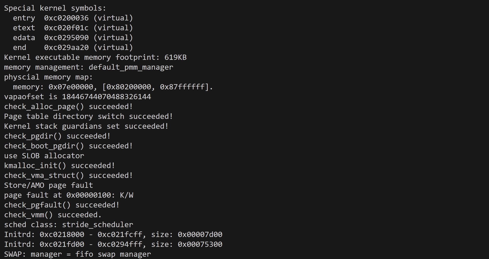
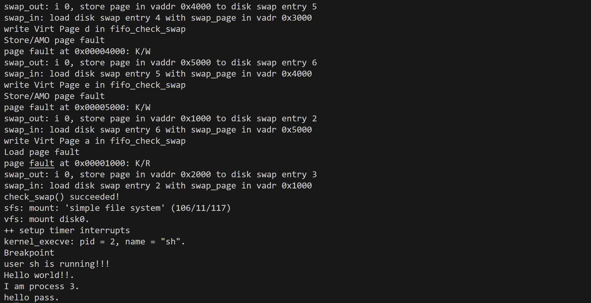
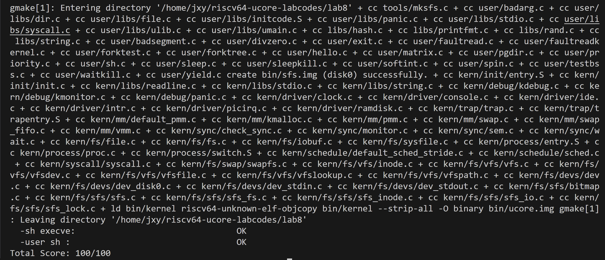

###Lab8
####练习1：完成读文件操作的实现(sfs_io_nolock())
#####打开文件的处理流程
文件打开的过程中需要文件系统三个层次进行交互：

**通用文件访问接口层**
   
open函数会进一步调用sys_open,进而调用syscall引起系统调用而进入到内核态。这里通过中断处理流程，会调用内核中的sys_open以及sysfile_open函数

```C
int
sysfile_open(const char *__path, uint32_t open_flags) {
    int ret;
    char *path;
    if ((ret = copy_path(&path, __path)) != 0) {
        return ret;
    }
    ret = file_open(path, open_flags);
    kfree(path);
    return ret;
}
```
在sysfile_open函数中会将用户空间的字符串_path拷贝到内核空间中的path，然后调用file_open进一步调用vfs_open，利用VFS接口进入文件系统抽象层完成打开文件操作

**文件系统抽象层**

- 文件系统抽象层会分配一个空闲的file数据结构变量，即打开文件数组中一个没有打开过的文件。这一步通过file_open函数实现，他会给这个即将打开的文件分配一个file数据结构变量。
  
```C
int file_open(char *path, uint32_t open_flags) {
    bool readable = 0, writable = 0;
    switch (open_flags & O_ACCMODE) { //解析 open_flags
    case O_RDONLY: readable = 1; break;
    case O_WRONLY: writable = 1; break;
    case O_RDWR:
        readable = writable = 1;
        break;
    default:
        return -E_INVAL;
    }
    int ret;
    struct file *file;
    if ((ret = fd_array_alloc(NO_FD, &file)) != 0) { //在当前进程分配file descriptor
        return ret; 
    }
    struct inode *node;
    if ((ret = vfs_open(path, open_flags, &node)) != 0) { //打开文件的工作在vfs_open完成
        fd_array_free(file); //打开失败，释放file descriptor
        return ret;
    }
    file->pos = 0;
    if (open_flags & O_APPEND) {
        struct stat __stat, *stat = &__stat;
        if ((ret = vop_fstat(node, stat)) != 0) {
            vfs_close(node);
            fd_array_free(file);
            return ret;
        }
        file->pos = stat->st_size; //追加写模式，设置当前位置为文件尾
    }
    file->node = node;
    file->readable = readable;
    file->writable = writable;
    fd_array_open(file); //设置该文件的状态为“打开”
    return file->fd;
}
```
- 可以看到在上述file_open函数中调用了vfs_open函数，找到刚刚从通用文件访问接口层传递下来的path所指出的文件，以及其对应的inode数据结构的VFS索引节点。同时，vfs_open函数也会打开path所指向的文件，如果打开成功则会设置文件的状态为打开状态。如果打开失败则会返回错误信息。

```C
int
vfs_open(char *path, uint32_t open_flags, struct inode **node_store) {
    bool can_write = 0;
    switch (open_flags & O_ACCMODE) {
    case O_RDONLY:
        break;
    case O_WRONLY:
    case O_RDWR:
        can_write = 1;
        break;
    default:
        return -E_INVAL;
    }

    if (open_flags & O_TRUNC) {
        if (!can_write) {
            return -E_INVAL;
        }
    }

    int ret; 
    struct inode *node;
    bool excl = (open_flags & O_EXCL) != 0;
    bool create = (open_flags & O_CREAT) != 0;
    ret = vfs_lookup(path, &node);

    if (ret != 0) {
        if (ret == -16 && (create)) {
            char *name;
            struct inode *dir;
            if ((ret = vfs_lookup_parent(path, &dir, &name)) != 0) {
                return ret;
            }
            ret = vop_create(dir, name, excl, &node);
        } else return ret;
    } else if (excl && create) {
        return -E_EXISTS;
    }
    assert(node != NULL);
    
    if ((ret = vop_open(node, open_flags)) != 0) {
        vop_ref_dec(node);
        return ret;
    }

    vop_open_inc(node);
    if (open_flags & O_TRUNC || create) {
        if ((ret = vop_truncate(node, 0)) != 0) {
            vop_open_dec(node);
            vop_ref_dec(node);
            return ret;
        }
    }
    *node_store = node;
    return 0;
}
```
- 在vfs_open函数中先调用vfs_lookup找path对应文件的inode（这里vfs_lookup调用vop_lookup找SFS文件系统中的目录下的文件），再open打开文件
  
**这里我们会注意到一些以vop开头的函数，都通过一些宏和函数的转发，最后变成对inode结构体里的inode_ops结构体的“成员函数”（实际上是函数指针）的调用。**

同时我们可以注意到一些和文件状态相关的标志位，例如：
```C
// flags for open: choose one of these
#define O_RDONLY            0           // open for reading only
#define O_WRONLY            1           // open for writing only
#define O_RDWR              2           // open for reading and writing
// then or in any of these:
#define O_CREAT             0x00000004  // 如果文件不存在，则创建文件。该标志用于在打开文件时创建文件，如果文件已存在则忽略
#define O_EXCL              0x00000008  // 如果文件已存在，打开会失败，产生错误。用于确保只有一个进程创建文件
#define O_TRUNC             0x00000010  // 如果文件存在且成功打开为写入模式，则将文件截断为零长度。即清空文件内容。
#define O_APPEND            0x00000020  // 打开文件时，将文件偏移量设置为文件的末尾，这样写入操作就会在文件末尾追加内容。
// additonal related definition
#define O_ACCMODE           3           // 一个掩码，用于提取访问模式的标志。可以使用它来判断打开文件的访问模式，通过对其进行按位与操作
```

**SFS文件系统层**

在这一层需要进一步分析在文件系统抽象层中出现的vop_lookup函数。
可以看到在sfs_inode.c文件中定义了vop_lookup函数就是sfs_lookup函数,于是接下来我们分析sfs_lookup函数做了什么

```C
static int
sfs_lookup(struct inode *node, char *path, struct inode **node_store) {
    struct sfs_fs *sfs = fsop_info(vop_fs(node), sfs);
    assert(*path != '\0' && *path != '/');
    vop_ref_inc(node);
    struct sfs_inode *sin = vop_info(node, sfs_inode);
    if (sin->din->type != SFS_TYPE_DIR) {
        vop_ref_dec(node);
        return -E_NOTDIR;
    }
    struct inode *subnode;
    int ret = sfs_lookup_once(sfs, sin, path, &subnode, NULL);

    vop_ref_dec(node);
    if (ret != 0) {
        return ret;
    }
    *node_store = subnode;
    return 0;
}
```
sfs_lookup函数以"/"为分割符，从左至右逐一分解path获得各个子目录和最终文件对应的inode节点。这里通过调用sfs_lookup_once函数来查找目标文件的inode节点。

```C
static int
sfs_lookup_once(struct sfs_fs *sfs, struct sfs_inode *sin, const char *name, struct inode **node_store, int *slot) {
    int ret;
    uint32_t ino;
    lock_sin(sin);
    {   // find the NO. of disk block and logical index of file entry
        ret = sfs_dirent_search_nolock(sfs, sin, name, &ino, slot, NULL);
    }
    unlock_sin(sin);
    if (ret == 0) {
		// load the content of inode with the the NO. of disk block
        ret = sfs_load_inode(sfs, node_store, ino);
    }
    return ret;
}
```
sfs_lookup_once将调用sfs_dirent_search_nolock函数来查找与路径名匹配的目录项，如果找到目录项，则根据目录项中记录的inode所处的数据块索引值找到路径名对应的SFS磁盘inode，并读入SFS磁盘inode对的内容，创建SFS内存inode。

总的来说，通用文件访问接口层将用户空间的路径path拷贝到了内核空间，并传给了文件系统抽象层；在文件系统抽象层中通过SFS文件系统提供的函数进行了文件的打开。SFS文件系统层通过逐一分解path获得各个子目录以及最终文件对应的inode节点。

#####完善sfs_io_nolock()函数
```C
static int
sfs_io_nolock(struct sfs_fs *sfs, struct sfs_inode *sin, void *buf, off_t offset, size_t *alenp, bool write) {
    struct sfs_disk_inode *din = sin->din;
    assert(din->type != SFS_TYPE_DIR);
    off_t endpos = offset + *alenp, blkoff;
    *alenp = 0;
	// calculate the Rd/Wr end position
    if (offset < 0 || offset >= SFS_MAX_FILE_SIZE || offset > endpos) {
        return -E_INVAL;
    }
    if (offset == endpos) {
        return 0;
    }
    if (endpos > SFS_MAX_FILE_SIZE) {
        endpos = SFS_MAX_FILE_SIZE;
    }
    if (!write) {
        if (offset >= din->size) {
            return 0;
        }
        if (endpos > din->size) {
            endpos = din->size;
        }
    }

    int (*sfs_buf_op)(struct sfs_fs *sfs, void *buf, size_t len, uint32_t blkno, off_t offset);
    int (*sfs_block_op)(struct sfs_fs *sfs, void *buf, uint32_t blkno, uint32_t nblks);
    if (write) {
        sfs_buf_op = sfs_wbuf, sfs_block_op = sfs_wblock;
    }
    else {
        sfs_buf_op = sfs_rbuf, sfs_block_op = sfs_rblock;
    }

    int ret = 0;
    size_t size, alen = 0;
    uint32_t ino;
    uint32_t blkno = offset / SFS_BLKSIZE;          // The NO. of Rd/Wr begin block
    uint32_t nblks = endpos / SFS_BLKSIZE - blkno;  // The size of Rd/Wr blocks
```
在读取文件时，主要进行一下几步预备操作

- 首先定义一些辅助变量
  
  - din用于获取文件对应的磁盘索引结构，紧跟着利用断言来确该文件不是目录
  - endpos用于记录文件读写的结束位置
  - alenp用于记录已读写的数据长度
  
- 接下来需要进行一些合法性检查
  
  - 检查offset是否合法，如果不合法则返回-E_INVAL表示参数无效；如果offset==endpos，则说明不需要读取数据，直接返回0即可
  - 检查endpos和最大文件大小的关系，如果endpos大于等于该值，则直接将endpos截断为最大文件大小
  - 对于!write操作，需要保证读取范围的合法性

- 合法性检查后则可以准备进行文件的读写
  
  - 首先根据读写类型定义了函数指针，并选择相应的缓冲区和块操作大小
  - 紧接着定义了一些和文件读写相关的变量，包括每个块要读取或写入的数据大小size、累积了跨多个块读取或写入的数据的总大小alen、当前正在处理的块的 inode 编号ino、当前正在处理的块的 inode 编号blkno以及当前操作中要读取或写入的块数nblks

接下来正式进行文件的读写，也是练习一添加代码的部分
```C
    //LAB8:EXERCISE1
    if ((blkoff = offset % SFS_BLKSIZE) != 0) {
        size = (nblks != 0) ? (SFS_BLKSIZE - blkoff) : (endpos - offset);
        if ((ret = sfs_bmap_load_nolock(sfs, sin, blkno, &ino)) != 0) {
            goto out;
        }
        if ((ret = sfs_buf_op(sfs, buf, size, ino, blkoff)) != 0) {
            goto out;
        }

        alen += size;
        buf += size;

        if (nblks == 0) {
            goto out;
        }

        blkno++;
        nblks--;
    }

    if (nblks > 0) {
        if ((ret = sfs_bmap_load_nolock(sfs, sin, blkno, &ino)) != 0) {
            goto out;
        }
        if ((ret = sfs_block_op(sfs, buf, ino, nblks)) != 0) {
            goto out;
        }

        alen += nblks * SFS_BLKSIZE;
        buf += nblks * SFS_BLKSIZE;
        blkno += nblks;
        nblks -= nblks;
    }

    if ((size = endpos % SFS_BLKSIZE) != 0) {
        if ((ret = sfs_bmap_load_nolock(sfs, sin, blkno, &ino)) != 0) {
            goto out;
        }
        if ((ret = sfs_buf_op(sfs, buf, size, ino, 0)) != 0) {
            goto out;
        }
        alen += size;
    }

out:
    *alenp = alen;
    if (offset + alen > sin->din->size) {
        sin->din->size = offset + alen;
        sin->dirty = 1;
    }
    return ret;
}
```
对于文件的读写，主要需要处理以下三种情况：

- if条件判断来处理非整块读写的情况
  - 如果 offset 在块内的偏移不为零，表示读写的起始位置不在块的开头。
  - 计算需要读写的数据大小 size，如果还有块需要读写（整块读写），则为当前块中剩余的空间，否则为endpos - offset(非整块读写)
  - 调用 sfs_bmap_load_nolock 函数获取块号对应的磁盘块号，并将结果存储在 ino 中。下面会分析 sfs_bmap_load_nolock 函数
  - 调用 sfs_buf_op 函数执行缓冲区操作，读写部分块的数据。sfs_buf_op的分析也在下文中
  - 更新已读写的数据长度 alen，移动缓冲区指针 buf。
  - 如果没有剩余的块需要读写，则跳转到 out 标签，结束函数；否则，增加块编号 blkno，减少待处理块数 nblks。

- 处理整块读写的情况

  - 如果还有剩余的块需要读写，通过 sfs_bmap_load_nolock 获取块号对应的磁盘块号，并将结果存储在 ino 中。
  - 调用 sfs_block_op 函数执行整块的数据读写。
  - 更新已读写的数据长度 alen，移动缓冲区指针 buf，增加块编号 blkno，减少待处理块数 nblks。
    
- 处理非整块读写的结束位置

  - 如果结束位置 endpos 不在块的末尾，再次通过 sfs_bmap_load_nolock 获取块号对应的磁盘块号，并将结果存储在 ino 中。
  - 调用 sfs_buf_op 函数执行剩余部分块的数据读写。
  - 更新已读写的数据长度 alen。

最后在out标签处统一做以下操作：

- 更新文件大小
  
根据已读写的数据长度更新文件大小，如果 offset + alen 大于当前文件大小，则说明在读写过程中改变了文件的大小，这时候需要更新文件大小，并将脏位dirty置为1，表示文件内容已被修改，需要在合适的时间将这些修改同步到磁盘上。

- 返回结果

将已读写的数据长度写入 *alenp。
返回读写操作的结果码 ret。

接下来分析一下上文提到过的两个函数sfs_bmap_load_nolock以及sfs_buf_op

sfs_bmap_load_nolock
```C
static int
sfs_bmap_load_nolock(struct sfs_fs *sfs, struct sfs_inode *sin, uint32_t index, uint32_t *ino_store) {
    struct sfs_disk_inode *din = sin->din;
    assert(index <= din->blocks);
    int ret;
    uint32_t ino;
    bool create = (index == din->blocks);
    if ((ret = sfs_bmap_get_nolock(sfs, sin, index, create, &ino)) != 0) {
        return ret;
    }
    assert(sfs_block_inuse(sfs, ino));
    if (create) {
        din->blocks ++;
    }
    if (ino_store != NULL) {
        *ino_store = ino;
    }
    return 0;
}
```
sfs_bmap_load_nolock函数用于获取块号对应的磁盘块号，这里根据index 和 din->blocks 之间的关系进行是否需要创建新块的判断。如果当前要处理的块==已使用的块数，则需要创建新的块。接下来通过sfs_bmap_get_nolock函数获取块号对应的磁盘编号，并返回。最后如果创建了新块，则需要对一些变量值进行更新。  
这里需要关注sfs_bmap_load_nolock的返回值。正常情况下，返回值应该0，表示映射成功，这也就对应了在sfs_io_nolock函数中，如果sfs_bmap_load_nolock的返回值非0则会直接跳转到out标签，不再进行文件的读写操作。

在上面的代码分析中可以看到，对于写操作sfs_buf_op被赋值为sfs_wbuf，进行文件系统的写操作；反之如果是读操作则会被赋值为sfs_rbuf，这里以读操作的函数为例进行分析
```C
int
sfs_rbuf(struct sfs_fs *sfs, void *buf, size_t len, uint32_t blkno, off_t offset) {
    assert(offset >= 0 && offset < SFS_BLKSIZE && offset + len <= SFS_BLKSIZE);
    int ret;
    lock_sfs_io(sfs);
    {
        if ((ret = sfs_rwblock_nolock(sfs, sfs->sfs_buffer, blkno, 0, 1)) == 0) {
            memcpy(buf, sfs->sfs_buffer + offset, len);
        }
    }
    unlock_sfs_io(sfs);
    return ret;
}
```
该函数进行实际的文件读取操作，从指定块中将数据读取到了用户提供的缓冲区。这里调用 sfs_rwblock_nolock 函数，从磁盘中读取块数据到文件系统缓冲区(blkno 表示块号，0 表示读取操作，1 表示不需要创建新块),如果读取成功（== 0），则利用memcpy(buf, sfs->sfs_buffer + offset, len)将文件系统缓冲区中的部分数据复制到传入的缓冲区buf中。  
这里值得注意的是文件系统的I/O锁，在对文件系统中的数据进行读取操作时，需要首先对其上锁lock_sfs_io(sfs)，确保在执行文件读取操作期间不会有其他线程对文件系统进行修改。在读取结束后，会释放该I/O锁unlock_sfs_io(sfs)，使得其他线程可以继续访问文件系统。

####练习2: 完成基于文件系统的执行程序机制的实现（需要编码）
改写proc.c中的load_icode函数和其他相关函数，实现基于文件系统的执行程序机制。执行：make qemu。如果能看看到sh用户程序的执行界面，则基本成功了。如果在sh用户界面上可以执行”ls”,”hello”等其他放置在sfs文件系统中的其他执行程序，则可以认为本实验基本成功。

#####alloc_proc
在lab8中，为了保证进程可以访问到文件，在proc_struct中新添加了一个成员变量`struct files_struct *filesp`。 
因此在`alloc_proc`函数中，需要做一下修改，需要添加一个filesp指针的初始化，因此添加一句`proc->filesp = NULL;`从而完成初始化。
```c++
static struct proc_struct *
alloc_proc(void) {
    struct proc_struct *proc = kmalloc(sizeof(struct proc_struct));
    if (proc != NULL) {
        //省略之前的部分
        proc->filesp = NULL;
    }
    return proc;
}
```
#####do_fork
```c++
int
do_fork(uint32_t clone_flags, uintptr_t stack, struct trapframe *tf) {
    int ret = -E_NO_FREE_PROC;
    struct proc_struct *proc;
    if (nr_process >= MAX_PROCESS) {
        goto fork_out;
    }
    ret = -E_NO_MEM;
   if ((proc = alloc_proc()) == NULL) {
        goto fork_out;
    }

    proc->parent = current;
    assert(current->wait_state == 0);

    if (setup_kstack(proc) != 0) {
        goto bad_fork_cleanup_proc;
    }
    if (copy_files(clone_flags, proc) != 0) 
    { //将当前进程的fs复制到fork出的进程中
        goto bad_fork_cleanup_kstack;
    }
    if (copy_mm(clone_flags, proc) != 0) {
        goto bad_fork_cleanup_fs;
    }
    copy_thread(proc, stack, tf);

    bool intr_flag;
    local_intr_save(intr_flag);
    {
        proc->pid = get_pid();
        hash_proc(proc);
        set_links(proc);
    }
    local_intr_restore(intr_flag);

    wakeup_proc(proc);

    ret = proc->pid;
fork_out:
    return ret;

bad_fork_cleanup_fs:  //for LAB8  如果复制失败，则需要重置原先的操作
    put_files(proc);
bad_fork_cleanup_kstack:
    put_kstack(proc);
bad_fork_cleanup_proc:
    kfree(proc);
    goto fork_out;
}
```
do_fork函数在原先的基础上，多了file_struct结构的复制操作与执行失败时的重置操作。
这两部操作分别需要调用copy_files和put_files函数，具体修改见上述代码。

#####load_icode
load_icode函数的主要工作就是给用户进程建立一个能够让用户进程正常运行的用户环境。
```c++
static int
load_icode(int fd, int argc, char **kargv) 
{
    assert(argc >= 0 && argc <= EXEC_MAX_ARG_NUM);
    if (current->mm != NULL) {
        panic("load_icode: current->mm must be empty.\n");
    }
    int ret = -E_NO_MEM;
    struct mm_struct *mm;
    //1.调用mm_create函数来申请进程的内存管理数据结构mm所需内存空间，并对mm进行初始化
    if ((mm = mm_create()) == NULL) {
        goto bad_mm;
    }
    //2.申请新目录项的空间并完成目录项的设置
    if (setup_pgdir(mm) != 0) {
        goto bad_pgdir_cleanup_mm;
    }
    //创建页表
    struct Page *page;
    //3.从文件从磁盘中加载程序到内存
    struct elfhdr __elf, *elf = &__elf;
    //3.1调用load_icode_read函数读取ELF文件
    if ((ret = load_icode_read(fd, elf, sizeof(struct elfhdr), 0)) != 0) {
        goto bad_elf_cleanup_pgdir;
    }
    //判断这个文件是否合法
    if (elf->e_magic != ELF_MAGIC) {
        ret = -E_INVAL_ELF;
        goto bad_elf_cleanup_pgdir;
    }
    struct proghdr __ph, *ph = &__ph;
    uint32_t vm_flags, perm, phnum;
    //e_phnum代表程序段入口地址数目
    for (phnum = 0; phnum < elf->e_phnum; phnum ++)
    {
        //3.2循环读取程序的每个段的头部
        off_t phoff = elf->e_phoff + sizeof(struct proghdr) * phnum;
        if ((ret = load_icode_read(fd, ph, sizeof(struct proghdr), phoff)) != 0) {
            goto bad_cleanup_mmap;
        }
        if (ph->p_type != ELF_PT_LOAD) {
            continue ;
        }
        if (ph->p_filesz > ph->p_memsz) {
            ret = -E_INVAL_ELF;
            goto bad_cleanup_mmap;
        }
        if (ph->p_filesz == 0) {
            // continue ;
            // do nothing here since static variables may not occupy any space
        }
        //3.3建立对应的VMA
        vm_flags = 0, perm = PTE_U | PTE_V; //建立虚拟地址与物理地址之间的映射
        // 根据ELF文件中的信息，对各个段的权限进行设置
        if (ph->p_flags & ELF_PF_X) vm_flags |= VM_EXEC;
        if (ph->p_flags & ELF_PF_W) vm_flags |= VM_WRITE;
        if (ph->p_flags & ELF_PF_R) vm_flags |= VM_READ;
        // modify the perm bits here for RISC-V
        if (vm_flags & VM_READ) perm |= PTE_R;
        if (vm_flags & VM_WRITE) perm |= (PTE_W | PTE_R);
        if (vm_flags & VM_EXEC) perm |= PTE_X;
        //虚拟内存地址设置为合法的
        if ((ret = mm_map(mm, ph->p_va, ph->p_memsz, vm_flags, NULL)) != 0) {
            goto bad_cleanup_mmap;
        }
        //3.4为数据段代码段等分配页
        off_t offset = ph->p_offset;
        size_t off, size;
        //计算数据段和代码段的开始地址
        uintptr_t start = ph->p_va, end, la = ROUNDDOWN(start, PGSIZE);

        ret = -E_NO_MEM;
        //计算数据段和代码段终止地址
        end = ph->p_va + ph->p_filesz;
        while (start < end) 
        {   // 为TEXT/DATA段逐页分配物理内存空间
            if ((page = pgdir_alloc_page(mm->pgdir, la, perm)) == NULL) {
                ret = -E_NO_MEM;
                goto bad_cleanup_mmap;
            }
            off = start - la, size = PGSIZE - off, la += PGSIZE;
            if (end < la) {
                size -= la - end;
            }
            //将磁盘上的TEXT/DATA段读入到分配好的内存空间中去
            //每次读取size大小的块，直至全部读完
            if ((ret = load_icode_read(fd, page2kva(page) + off, size, offset)) != 0)
            {
                goto bad_cleanup_mmap;
            }
            start += size, offset += size;
        }
        //3.5为BBS段分配页
        //计算BBS的终止地址
        end = ph->p_va + ph->p_memsz;

        if (start < la) {
            /* ph->p_memsz == ph->p_filesz */
            if (start == end) {
                continue ;
            }
            off = start + PGSIZE - la, size = PGSIZE - off;
            if (end < la) {
                size -= la - end;
            }
            memset(page2kva(page) + off, 0, size);
            start += size;
            assert((end < la && start == end) || (end >= la && start == la));
        }
        while (start < end) 
        {// 如果没有给BSS段分配足够的页，进一步进行分配
            if ((page = pgdir_alloc_page(mm->pgdir, la, perm)) == NULL) {
                ret = -E_NO_MEM;
                goto bad_cleanup_mmap;
            }
            off = start - la, size = PGSIZE - off, la += PGSIZE;
            if (end < la) {
                size -= la - end;
            }
            memset(page2kva(page) + off, 0, size);
            start += size;
        }
    }
    sysfile_close(fd);//关闭文件，加载程序结束
    // 4.设置用户栈
    vm_flags = VM_READ | VM_WRITE | VM_STACK;   //设置用户栈的权限
     //将用户栈所在的虚拟内存区域设置为合法的
    if ((ret = mm_map(mm, USTACKTOP - USTACKSIZE, USTACKSIZE, vm_flags, NULL)) != 0) {
        goto bad_cleanup_mmap;
    }
    assert(pgdir_alloc_page(mm->pgdir, USTACKTOP-PGSIZE , PTE_USER) != NULL);
    assert(pgdir_alloc_page(mm->pgdir, USTACKTOP-2*PGSIZE , PTE_USER) != NULL);
    assert(pgdir_alloc_page(mm->pgdir, USTACKTOP-3*PGSIZE , PTE_USER) != NULL);
    assert(pgdir_alloc_page(mm->pgdir, USTACKTOP-4*PGSIZE , PTE_USER) != NULL);
    //设置当前进程的mm、cr3等
    mm_count_inc(mm);
    current->mm = mm;
    current->cr3 = PADDR(mm->pgdir);
    lcr3(PADDR(mm->pgdir));
    //为用户空间设置trapeframe
    //setup argc, argv
    uint32_t argv_size=0, i;
    //确定传入给应用程序的参数具体应当占用多少空间
    for (i = 0; i < argc; i ++) {
        argv_size += strnlen(kargv[i],EXEC_MAX_ARG_LEN + 1)+1;
    }
    // 用户栈顶减去所有参数加起来的长度，与4字节对齐找到真正存放字符串参数的栈的位置
    uintptr_t stacktop = USTACKTOP - (argv_size/sizeof(long)+1)*sizeof(long);
    //存放指向字符串参数的指针
    char** uargv=(char **)(stacktop  - argc * sizeof(char *));
    
    argv_size = 0;
    for (i = 0; i < argc; i ++) {
        uargv[i] = strcpy((char *)(stacktop + argv_size ), kargv[i]);
        argv_size +=  strnlen(kargv[i],EXEC_MAX_ARG_LEN + 1)+1;
    }
     // 根据参数需要在栈上占用的空间来推算出，传递了参数之后栈顶的位置
    stacktop = (uintptr_t)uargv - sizeof(int);
    *(int *)stacktop = argc;
    
    struct trapframe *tf = current->tf;
    // Keep sstatus
    //6.设置进程的中断帧  
	//设置tf相应的变量的设置，包括：tf_cs、tf_ds tf_es、tf_ss tf_esp, tf_eip, tf_eflags
    uintptr_t sstatus = tf->status;
    memset(tf, 0, sizeof(struct trapframe));
    tf->gpr.sp = stacktop;
    tf->epc = elf->e_entry;
    tf->status = sstatus & ~(SSTATUS_SPP | SSTATUS_SPIE);
    ret = 0;
out:
    return ret;
bad_cleanup_mmap:
    exit_mmap(mm);
bad_elf_cleanup_pgdir:
    put_pgdir(mm);
bad_pgdir_cleanup_mm:
    mm_destroy(mm);
bad_mm:
    goto out;
}
```
具体实现步骤如下：
- 调用mm_create函数来申请进程的内存管理数据结构mm所需内存空间，并对mm进行初始化；
 
- 调用setup_pgdir来申请一个页目录表所需的一个页大小的内存空间，并把描述ucore内核虚空间映射的内核页表（boot_pgdir所指）的内容拷贝到此新目录表中，最后让mm->pgdir指向此页目录表，这就是进程新的页目录表了，且能够正确映射内核虚空间；

- 根据应用程序文件的文件描述符（fd）通过调用load_icode_read()函数来加载和解析此ELF格式的执行程序，并调用mm_map函数根据ELF格式的执行程序说明的各个段（代码段、数据段、BSS段等）的起始位置和大小建立对应的vma结构，并把vma插入到mm结构中，从而表明了用户进程的合法用户态虚拟地址空间；

- 调用根据执行程序各个段的大小分配物理内存空间，并根据执行程序各个段的起始位置确定虚拟地址，并在页表中建立好物理地址和虚拟地址的映射关系，然后把执行程序各个段的内容拷贝到相应的内核虚拟地址中，至此应用程序执行码和数据已经根据编译时设定地址放置到虚拟内存中了；

- 需要给用户进程设置用户栈，为此调用mm_mmap函数建立用户栈的vma结构，明确用户栈的位置在用户虚空间的顶端，大小为256个页，即1MB，并分配一定数量的物理内存且建立好栈的虚地址<-->物理地址映射关系；

- 至此,进程内的内存管理vma和mm数据结构已经建立完成，于是把mm->pgdir赋值到cr3寄存器中，即更新了用户进程的虚拟内存空间，设置uargc和uargv在用户栈中。此时的initproc已经被代码和数据覆盖，成为了第一个用户进程，但此时这个用户进程的执行现场还没建立好；

- 先清空进程的中断帧，再重新设置进程的中断帧，使得在执行中断返回指令“iret”后，能够让CPU转到用户态特权级，并回到用户态内存空间，使用用户态的代码段、数据段和堆栈，且能够跳转到用户进程的第一条指令执行，并确保在用户态能够响应中断；

实验8和实验5中load_icode()函数代码最大不同的地方在于读取EFL文件的方式，实验5中是通过获取ELF在内存中的位置，根据ELF的格式进行解析，而在实验8中则是通过ELF文件的文件描述符调用load_icode_read()函数来进行解析程序。

下面具体分析load_icode_read()函数
```c++
static int
load_icode_read(int fd, void *buf, size_t len, off_t offset) 
{
    int ret;
    if ((ret = sysfile_seek(fd, offset, LSEEK_SET)) != 0) 
    {
        return ret;
    }
    if ((ret = sysfile_read(fd, buf, len)) != len) 
    {
        return (ret < 0) ? ret : -1;
    }
    return 0;
}
```
- 这个函数是用来从文件描述符fd指向的文件中读取数据到buf中的。函数的入参包括fd（文件描述符）、buf（指向读取数据的缓冲区）、len（要读取的数据长度）和offset（文件中的偏移量）。

- 函数首先调用sysfile_seek函数将文件指针移动到指定的偏移量处。如果sysfile_seek返回错误码，则load_icode_read直接返回该错误码。

- 接着，函数调用sysfile_read函数从文件中读取指定长度的数据到buf中。如果读取的数据长度不等于要求的长度len，则load_icode_read返回错误码-1；如果读取过程中发生了错误，则load_icode_read返回sysfile_read函数的错误码。

- 最后，如果函数执行成功，则load_icode_read返回0。


####扩展练习 Challenge1 完成基于“UNIX的PIPE机制”的设计方案
如果要在ucore里加入UNIX的管道（Pipe)机制，至少需要定义哪些数据结构和接口？（接口给出语义即可，不必具体实现。数据结构的设计应当给出一个(或多个）具体的C语言struct定义。在网络上查找相关的Linux资料和实现，请在实验报告中给出设计实现”UNIX的PIPE机制“的概要设方案，你的设计应当体现出对可能出现的同步互斥问题的处理。）
######管道(Pipe)的数据结构
管道(Pipe)其实就是一个操作系统内核管理的环形缓冲区，所以需要一块内存作为缓冲区，然后需要记录环形缓冲区的头部和尾部。当一个进程尝试从空管道读取数据或者向满管道写入数据的时候，操作系统内核需要将进程阻塞，因此还需要一个读取等待队列和一个写入等待队列。缓冲区大小通常设为一页的大小4KB。
以下是管道结构体的大致代码，其中包括缓冲区的头和尾，读取和写入队列以及环形缓冲区。
```c
struct Pipe {
    size_t head; // 缓冲区头部
    size_t tail; // 缓冲区尾部
    wait_queue_t read_queue; // 管道读取等待队列
    wait_queue_t write_queue; // 管道写入等待队列
    char * buffer; // 环形缓冲区
    struct spinlock lock; //对管道进行加锁
};
```
######管道(Pipe)操作
1. 创建管道

首先需要创建管道的信息节点，而进程需要得到管道的文件描述符用于读写，所以管道创建接口在创建好信息节点之后，还需要创建两个文件描述符，一个文件描述符只读，另外一个文件描述符只写。
由于管道只被文件描述符引用，不存在于实际的文件系统中，因此打开计数值永远等于引用计数值。
以下是一个初始化管道的基本函数定义：
```c
void pipe_init(struct Pipe *p, int size)
```

2. 关闭管道

当管道信息节点的打开计数变为0后，管道关闭操作就会被虚拟文件系统调用。对于管道而言，引用计数值等于打开计数值。当管道相关的文件描述符全部关闭后，由回收操作进行内存资源回收，关闭操作不需要做任何工作。
```c
void pipe_close(struct Pipe *p)
```

3. 回收管道

当管道的全部文件描述符关闭后，虚拟文件系统调用管道回收操作回收缓冲区内存以及信息节点使用的内存。


4. 读取管道

读取过程采用逐字节读取的方式读取数据，对于每一个字节的数据：

(1)若缓冲区非空，那么取出一个字节后，唤醒处于写入等待队列中的进程，然后尝试下一个字节；

(2)若缓冲区为空，那么进程将自己加入读取等待队列，主动进入阻塞状态，等待进程被唤醒后再次尝试；

(3)如果全部要求的数据全部读取完毕，那么结束读取过程，返回读取到的字节数。
```c
void pipe_read(struct pipe *p, void *buffer, int size)
```

5. 写入管道

写入过程和读取过程非常类似，也是采用逐字节读取的方式写入数据，对于每一个字节的数据：如果缓冲区非满，那么写入一个字节后，唤醒处于读取等待队列中的进程，然后尝试下一个字节；如果缓冲区为满，那么进程将自己加入写入等待队列，主动进入阻塞状态，等待进程被唤醒后再次尝试；如果全部要求的数据全部写入完毕，那么结束读取过程，返回写入的字节数。
```c
void pipe_write(struct pipe *p, const void *buffer, int size)
```
######同步互斥处理
使用`spinlock`对管道结构进行加锁，以保证在多线程环境下对管道的访问是互斥的。

使用等待队列`read_queue`，`write_queue`来实现读取和写入的同步。当管道中没有数据可读时，读取操作需要等待；当管道满时，写入操作需要等待。


####扩展练习 Challenge2：完成基于“UNIX的软连接和硬连接机制”的设计方案
如果要在ucore里加入UNIX的软连接和硬连接机制，至少需要定义哪些数据结构和接口？(接口给出语义即可，不必具体实现。数据结构的设计应当给出一个(或多个)具体的C语言struct定义。在网络上查找相关的Linux资料和实现，请在实验报告中给出设计实现”UNIX的软连接和硬连接机制“的概要设方案，你的设计应当体现出对可能出现的同步互斥问题的处理。)

首先来看什么是软链接与硬链接机制：
- 硬链接是指在文件系统中创建一个新的目录项，它与已经存在的文件实际上指向相同的 inode（索引节点）。inode 包含有关文件的元数据，如文件的权限、所有者和时间戳等信息，以及指向文件数据块的指针。
- 所有硬链接与原始文件共享相同的 inode 和数据块。因此，它们指向相同的实际数据，硬链接之间没有物理上的区别。
- 硬链接的文件内容与创建时指向的源文件一模一样，把源文件删除，不会影响硬链接文件。删除一个硬链接并不会影响其他硬链接，只有当所有硬链接都被删除时，才会释放文件的磁盘空间。

- 软链接是一个独立的文件，它包含一个指向另一个文件或目录的路径。这个路径可以是相对路径或绝对路径。
- 软链接与硬链接不同，它有自己的 inode 和数据块，而这些数据块包含的是目标文件的路径。因此，软链接实际上是一个指向另一个文件的符号。

基本数据结构和接口在本次实验中均已定义：
```c++
/* inode (on disk) */
struct sfs_disk_inode {
    uint32_t size;                                  /* size of the file (in bytes) */
    uint16_t type;                                  /* one of SYS_TYPE_* above */
    uint16_t nlinks;                                /* # of hard links to this file */
    uint32_t blocks;                                /* # of blocks */
    uint32_t direct[SFS_NDIRECT];                   /* direct blocks */
    uint32_t indirect;                              /* indirect blocks */
//    uint32_t db_indirect;                           /* double indirect blocks */
//   unused
};
```
保存在磁盘上的inode信息通过nlinks来表示当前文件被链接的计数，从而可以支持软链接和硬链接机制。
```c++
int vfs_link(char *old_path, char *new_path);
int vfs_symlink(char *old_path, char *new_path);
int vfs_unlink(char *path);
```
```c++
int vfs_symlink(char *old_path, char *new_path);
```
语义：创建一个软连接，将`old_path`指向的路径保存在`linkpath`中。

```c++
int vfs_link(char *old_path, char *new_path);
```
语义：在文件系统中创建一个硬链接，使`newpath`成为`oldpath`的另一个别名。

```c++
int vfs_unlink(char *path);
```
语义：删除文件路径 path 所指向的硬链接，减少相应`inode`的链接计数器。

实现方式:
- 创建硬链接link时，为new_path创建对应的file，并把其inode指向old_path所对应的inode，inode的引用计数加1。
- 创建软连接link时，创建一个新的文件（inode不同），并把old_path的内容存放到文件的内容中去，给该文件保存在磁盘上时disk_inode类型为SFS_TYPE_LINK，再完善对于该类型inode的操作即可。
- 删除一个软链接B的时候，直接将其在磁盘上的inode删掉即可；但删除一个硬链接B的时候，除了需要删除掉B的inode之外，还需要将B指向的文件A的被链接计数减1，如果减到了0，则需要将A删除掉；


####运行结果展示
#####make qemu



#####make grade

