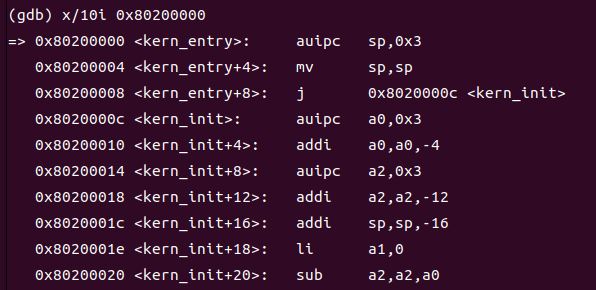

###Lab0.5
####练习1：使用GDB验证启动流程
#####0、前置工作

1.配置虚拟机环境


#####一、实验目的

* 为了熟悉使用qemu和gdb进行调试工作,使用gdb调试QEMU模拟的`RISC-V`计算机加电开始运行到执行应用程序的第一条指令（即跳转到`0x80200000`）这个阶段的执行过程。
* **说明RISC-V硬件加电后的几条指令在哪里？完成了哪些功能？**
  
#####二.实验过程

1.在Lab0中开启终端，运行`make qemu`以及`make gdb`


2.通过指令`‘ x/10i $pc ’`，查看即将运行的10条汇编指令,通过指令`‘ ni ’`可以对操作进行单步跟踪。


3.连续进行单步跟踪，可以发现执行到`0x1010`这条汇编指令的时候，跳转到了`0x80000000`,说明`0x1010`这条汇编指令指令指定了跳转到`bootloader`开始运行时的代码。


4.通过指令`break *0x80200000`可以在`0x80200000`处设置断点


5.执行`‘ continue ’`命令，程序会一直运行直到`0x80200000` （kern/init/entry.S）。此时执行到了`la sp，bootstacktop`这一步。


可以发现，同时OpenSBI启动


6.执行‘ ni ’指令，程序继续运行到下一步tail `kern_init，tail`是一个跳转的汇编指令，能将进程跳转到"kernel_init"函数的入口点。即进程将进入kern_init()函数（kern/init/init.c）


init.c函数如下
```C
#include <stdio.h>
#include <string.h>
#include <sbi.h>
int kern_init(void) __attribute__((noreturn));

int kern_init(void) {
    extern char edata[], end[];
    memset(edata, 0, end - edata);

    const char *message = "(THU.CST) os is loading ...\n";
    cprintf("%s\n\n", message);
   while (1)
        ;
}
```
7.执行‘ ni ’指令，进入循环中，首先要执行memset这一步。


8.执行‘ n ’指令，即将运行当前源程序中的cprint函数。


9.执行‘ n ’指令，cprint函数运行完毕，可以发现在make debug终端中成功输出了cprint要输出的内容。


#####三、实验分析

**说明RISC-V硬件加电后的几条指令在哪里，完成了哪些功能**

RISC-V的启动顺序分为三个阶段

**第一阶段：将必要的文件载入到 Qemu 物理内存之后，Qemu CPU 的程序计数器会被初始化为 0x1000，接下来它将执行几条指令并跳转到物理地址 0x80000000 对应的指令处并进入第二阶段**


**第二阶段：bootloader opensbi.bin 放在以物理地址 0x80000000 开头的物理内存中，在这一阶段，bootloader 负责对计算机进行一些初始化工作，并跳转到下一阶段软件的入口，在 Qemu 上即可实现将计算机控制权移交给我们的内核镜像 os.bin 。**


**第三阶段：需要将内核镜像预先加载到 Qemu 物理内存以地址 0x80200000 开头的区域上。一旦 CPU 开始执行内核的第一条指令，证明计算机的控制权已经被移交给我们的内核，也就完成了加载操作系统的目标**




#####四、实验总结
本次实验我们了解了RISC-V计算机上电启动的三个阶段，并通过gdb调式的指令，结合qemu工具对于整个启动过程进行了演示，最后通过make debug在终端输出结果。通过本次实验，我们对gdb指令有了更好的掌握，并学会了如何使用qemu和dbg工具对程序进行调试，为之后的实验打下了基础。在之后的实验中会继续学习有关gdb的调试指令。


<div STYLE="page-break-after: always;"></div>

###Lab1
####练习1：理解内核启动中的程序入口操作

阅读 kern/init/entry.S内容代码，结合操作系统内核启动流程，说明指令 `la sp, bootstacktop` 完成了什么操作，目的是什么？ `tail kern_init` 完成了什么操作，目的是什么？


kern/init/entry.S代码如下：
```C++
#include <mmu.h>
#include <memlayout.h>

    .section .text,"ax",%progbits
    .globl kern_entry
kern_entry:
    la sp, bootstacktop

    tail kern_init

.section .data
    # .align 2^12
    .align PGSHIFT
    .global bootstack
bootstack:
    .space KSTACKSIZE
    .global bootstacktop
bootstacktop:
```

**la sp, bootstacktop**

`la sp, bootstacktop`指令用于设置栈指针（Stack Pointer）。设置栈指针的目的是为了为内核的执行提供一个可用的存储区域。操作系统可以在执行期间使用栈来维护函数调用的上下文和临时数据。"la"是一个汇编指令，用于加载一个地址到寄存器。"bootstacktop"是一个地址标号，指向操作系统内核为栈分配的顶部位置。这条指令的目的是将栈指针设置为内核栈的顶部，以便操作系统可以使用栈来存储函数调用和局部变量。

**tail kern_init**

`tail kern_init`指令用于跳转到"kernel_init"函数的入口点，目的是为了将控制转移给内核初始化函数，并开始操作系统内核的正常运行。"tail"是一个汇编指令，它会将当前函数的返回地址保存在链接寄存器中，并跳转到目标函数的入口点。
"kern_init"是操作系统内核初始化的入口函数，它负责执行一系列初始化操作，如设置中断向量表、初始化设备驱动程序、启动调度器等。通过跳转到"kernel_init"函数，操作系统开始执行初始化过程，以准备好接收和处理系统的进一步操作。

####练习2：完善中断处理（需要编程）
#####一、实验目的
请编程完善trap.c中的中断处理函数trap，在对时钟中断进行处理的部分填写kern/trap/trap.c函数中处理时钟中断的部分，使操作系统每遇到100次时钟中断后，调用`print_ticks`子程序，向屏幕上打印一行文字”100 ticks”，在打印完10行后调用sbi.h中的`shut_down()`函数关机。
#####二、实验过程

1.根据trap.c函数中的注释描述可以知道，需要添加地代码主要做以下四个工作

①设置下次时钟中断，即调用`clock_set_next_event()`函数

②计数器加一，即`ticks++`，用于记录时钟中断次数和100进行比较判断

③当计数器加到100的时候，会输出一个`100ticks`表示我们触发了100次时钟中断，同时打印次数（num）加一。即在ticks=100时，要调用`print_ticks()`函数,同时`num++`。

④判断打印次数，当打印次数为10时，调用<sbi.h>中的关机函数关机。即判断num是否等于10，如果等于10则调用<sbi.h>中的`sbi_shutdown`函数。

根据以上四点要求，可以写出trap.c中要添加的代码
```C
clock_set_next_event();
ticks++;
if(ticks % TICK_NUM == 0)
{
    print_ticks();
    num++;  
}
if(num==10)
{
    sbi_shutdown();
} 
break;
```
在Lab1中开启终端，运行make qemu，可以看到大概每1秒钟会输出一行100 ticks到终端。一共输出十行，十行之后自动关闭。


####Challenge1：描述与理解中断流程
**问题：**

1.描述ucore中处理中断异常的流程（从异常的产生开始）。

2.其中`mov a0，sp`的目的是什么？

3.`SAVE_ALL`中寄存器保存在栈中的位置是什么确定的？

4.对于任何中断，`__alltraps` 中都需要保存所有寄存器吗？请说明理由。

trapentry.S相关部分代码如下

```assembly
#include <riscv.h>

    .globl __alltraps
.align(2)
__alltraps:
    SAVE_ALL

    move  a0, sp
    jal trap
    # sp should be the same as before "jal trap"

    .globl __trapret
__trapret:
    RESTORE_ALL
    # return from supervisor call
    sret
```

**分析：**

*问题一*：

①在中断发生时，CPU会跳到stvec寄存器，因此先对stvec寄存器进行初始化，直接跳到中断处理程序的入口点，也就是`trapentry.S`。

②对于中断的处理，要求CPU在处理完中断后又能恢复到原来的工作继续执行，因此需要保存一些寄存器的状态，从而防止异常处理过程中寄存器状态的被修改。trapentry.S函数可以保存和恢复上下文，并将其装成结构体送到trap函数进行中断处理。主要是通过定义一个汇编`SAVE_ALL`, 用来保存所有寄存器到栈顶以及定义一个恢复上下文的汇编宏来实现上述功能。

③在trap.c中的中断处理函数中将异常处理的工作分发给了`interrupt_handler()`，`exception_handler()`两个函数，这两个函数再根据中断或异常的不同类型来处理。在执行完相应的操作后，恢复保存的寄存器的状态，以便返回到正常的程序执行流程。

*问题二*：

mov a0, sp汇编指令将栈指针(sp)的值保存到a0寄存器中。目的是将当前的栈指针保存下来，以便在异常处理过程中可以访问栈中的数据。

*问题三*：

在`__alltraps`的入口处，通过 `SAVE_ALL `宏来保存所有寄存器的值。这些寄存器的保存位置是由`SAVE_ALL`宏中定义的具体指令决定的。

*问题四*：

`__alltraps`并不需要保存所有寄存器。根据异常类型和平台的要求，`__alltraps`会选择保存和恢复必要的寄存器，以保证异常处理的正确性和效率。一些寄存器，如栈指针、程序计数器等，是必须保存的，因为它们包含了关键的执行状态。其他寄存器，如通用寄存器和浮点寄存器，可能根据具体的中断类型和需求来决定是否保存。保存所有寄存器可能会导致额外的开销和复杂性，而不是每个中断都需要访问和修改所有寄存器的值。


####Challenge2：理解上下文切换机制
**问题：**

1.在`trapentry.S`中汇编代码 `csrw sscratch, sp`；`csrrw s0, sscratch, x0`实现了什么操作，目的是什么？

2.save all里面保存了stval scause这些csr，而在restore all里面却不还原它们？那这样store的意义何在呢？

trapentry.S相关部分代码如下

```assembly
#include <riscv.h>

    .macro SAVE_ALL

    csrw sscratch, sp

    addi sp, sp, -36 * REGBYTES
    # save x registers
    STORE x0, 0*REGBYTES(sp)
    STORE x1, 1*REGBYTES(sp)
    STORE x3, 3*REGBYTES(sp)
    STORE x4, 4*REGBYTES(sp)
    STORE x5, 5*REGBYTES(sp)
    STORE x6, 6*REGBYTES(sp)
    STORE x7, 7*REGBYTES(sp)
    STORE x8, 8*REGBYTES(sp)
    STORE x9, 9*REGBYTES(sp)
    STORE x10, 10*REGBYTES(sp)
    STORE x11, 11*REGBYTES(sp)
    STORE x12, 12*REGBYTES(sp)
    STORE x13, 13*REGBYTES(sp)
    STORE x14, 14*REGBYTES(sp)
    STORE x15, 15*REGBYTES(sp)
    STORE x16, 16*REGBYTES(sp)
    STORE x17, 17*REGBYTES(sp)
    STORE x18, 18*REGBYTES(sp)
    STORE x19, 19*REGBYTES(sp)
    STORE x20, 20*REGBYTES(sp)
    STORE x21, 21*REGBYTES(sp)
    STORE x22, 22*REGBYTES(sp)
    STORE x23, 23*REGBYTES(sp)
    STORE x24, 24*REGBYTES(sp)
    STORE x25, 25*REGBYTES(sp)
    STORE x26, 26*REGBYTES(sp)
    STORE x27, 27*REGBYTES(sp)
    STORE x28, 28*REGBYTES(sp)
    STORE x29, 29*REGBYTES(sp)
    STORE x30, 30*REGBYTES(sp)
    STORE x31, 31*REGBYTES(sp)

    # get sr, epc, badvaddr, cause
    # Set sscratch register to 0, so that if a recursive exception
    # occurs, the exception vector knows it came from the kernel
    csrrw s0, sscratch, x0
    csrr s1, sstatus
    csrr s2, sepc
    csrr s3, sbadaddr
    csrr s4, scause

    STORE s0, 2*REGBYTES(sp)
    STORE s1, 32*REGBYTES(sp)
    STORE s2, 33*REGBYTES(sp)
    STORE s3, 34*REGBYTES(sp)
    STORE s4, 35*REGBYTES(sp)
    .endm

    .macro RESTORE_ALL

    LOAD s1, 32*REGBYTES(sp)
    LOAD s2, 33*REGBYTES(sp)

    csrw sstatus, s1
    csrw sepc, s2

    # restore x registers
    LOAD x1, 1*REGBYTES(sp)
    LOAD x3, 3*REGBYTES(sp)
    LOAD x4, 4*REGBYTES(sp)
    LOAD x5, 5*REGBYTES(sp)
    LOAD x6, 6*REGBYTES(sp)
    LOAD x7, 7*REGBYTES(sp)
    LOAD x8, 8*REGBYTES(sp)
    LOAD x9, 9*REGBYTES(sp)
    LOAD x10, 10*REGBYTES(sp)
    LOAD x11, 11*REGBYTES(sp)
    LOAD x12, 12*REGBYTES(sp)
    LOAD x13, 13*REGBYTES(sp)
    LOAD x14, 14*REGBYTES(sp)
    LOAD x15, 15*REGBYTES(sp)
    LOAD x16, 16*REGBYTES(sp)
    LOAD x17, 17*REGBYTES(sp)
    LOAD x18, 18*REGBYTES(sp)
    LOAD x19, 19*REGBYTES(sp)
    LOAD x20, 20*REGBYTES(sp)
    LOAD x21, 21*REGBYTES(sp)
    LOAD x22, 22*REGBYTES(sp)
    LOAD x23, 23*REGBYTES(sp)
    LOAD x24, 24*REGBYTES(sp)
    LOAD x25, 25*REGBYTES(sp)
    LOAD x26, 26*REGBYTES(sp)
    LOAD x27, 27*REGBYTES(sp)
    LOAD x28, 28*REGBYTES(sp)
    LOAD x29, 29*REGBYTES(sp)
    LOAD x30, 30*REGBYTES(sp)
    LOAD x31, 31*REGBYTES(sp)
    # restore sp last
    LOAD x2, 2*REGBYTES(sp)
    #addi sp, sp, 36 * REGBYTES
    .endm
```

**分析：**

*问题一*：

`csrw sscratch, sp` 汇编指令将栈指针sp的值保存到 sscratch 控制和状态寄存器CSR中。这一步是为了在异常或中断处理期间保持栈的状态。通过将栈指针存储在 sscratch 寄存器中，可以在处理异常或中断时使用备份的栈指针，而不会干扰当前正在使用的栈指针。
`csrrw s0, sscratch, x0`汇编指令执行了一个特权级寄存器的读取-写入操作。它将 sscratch 寄存器的当前值读取到 s0 寄存器中，然后将 x0 寄存器的值写入 sscratch 寄存器中。目的是在保存栈指针之前，将 sscratch 寄存器的值备份到 s0 寄存器中，以便在处理完异常或中断后，恢复 sscratch 寄存器的原始值。

*问题二*：

在`save all`部分，CSR 中的一些重要的状态寄存器（例如 stval 和 scause）被保存在堆栈上的相应位置。这些 CSR 中保存了有关当前异常或中断的重要信息，如导致异常的原因和相关的数据。保存这些 CSR 到堆栈能够在处理完异常或中断后，通过从堆栈中恢复这些值来恢复现场，以确保正常的异常处理流程。

而在`restore all`部分，恢复了通用寄存器（如 a0、a1 等），但没有还原之前保存的 CSR 值。这是因为在异常或中断处理流程的最后阶段，处理器将自动通过使用 sret 或 uret 指令恢复这些 CSR 的原始值。这些指令会自动从栈中恢复之前保存的 CSR 值，以便将控制权返回到异常或中断之前的执行点。


####Challenge3：完善异常中断
编程完善在触发一条非法指令异常 mret和，在 kern/trap/trap.c的异常处理函数中捕获，并对其进行处理，简单输出异常类型和异常指令触发地址，即“Illegal instruction caught at 0x(地址)”，“ebreak caught at 0x（地址）”与“Exception type:Illegal instruction"，“Exception type: breakpoint”。

**实验过程**

1.在trap.c中添加相应代码，使得trap.c中的异常处理函数可以捕获，并对其进行处理。

在CAUSE_ILLEGAL_INSTRUCTION情况下，首先要输出指令异常类型，即`Illegal instruction`;还要输出异常指令的地址，即`Illegal instruction caught at 0x(地址)`,其中地址为当前tf指向寄存器的值；最后还要更新当前tf指向的寄存器的值。

编写的CAUSE_ILLEGAL_INSTRUCTION代码如下：

```C
case CAUSE_ILLEGAL_INSTRUCTION:
    // 非法指令异常处理
    /* LAB1 CHALLENGE3   YOUR CODE :  */
    /*(1)输出指令异常类型（ Illegal instruction）
    *(2)输出异常指令地址
    *(3)更新 tf->epc寄存器
    */
    cprintf("Exception type:Illegal instruction\n");
    cprintf("Illegal instruction caught at 0x%08x\n", tf->epc);
    tf->epc+=4;
    break;
```

在CAUSE_BREAKPOINT情况下，首先要输出指令异常类型，即`breakpoint`;还要输出异常指令的地址，即`ebreak caught at 0x(地址)`,其中地址为当前tf指向寄存器的值；最后还要更新当前tf指向的寄存器的值。

```C
case CAUSE_BREAKPOINT:
    //断点异常处理
    /* LAB1 CHALLLENGE3   YOUR CODE :  */
    /*(1)输出指令异常类型（ breakpoint）
     *(2)输出异常指令地址
     *(3)更新 tf->epc寄存器
    */
     
    cprintf("Exception type: breakpoint");
    cprintf("ebreak caught at 0x%08x\n", tf->epc);
    tf->epc+=4;
    break;
```

2.由于中断处理需要初始化，因此要在init.c里调用一些初始化的函数。为了对非法指令异常处理和断点异常处理进行测试，需要在init.c函数中添加相应的的函数，以便在后续的初始化中进行调用。

添加的代码如下：

```C
static inline void illegal_instruction(void) 
{
    __asm__ __volatile__(
        ".word 0xFFFFFFFF"   //0x80200050
    );
}

void ebreak_instruction(void) 
{
    __asm__ __volatile__(
        "ebreak" 
    );
}
```
`illegal_instruction`函数用于生成一个非法指令异常。在函数体内部，使用了内联汇编语言的 __asm__ __volatile__ 语法来嵌入汇编指令。汇编指令 `".word 0xFFFFFFFF"` 表示将 `0xFFFFFFFF` 写入内存中的指令位置。这是一个非法指令，因为它没有对应的有效的机器码。当程序执行到这个非法指令时，处理器会触发非法指令异常。

`ebreak_instruction`函数用于生成一个断点异常。类似于`illegal_instruction`函数，它也使用了内联汇编语言的 __asm__ __volatile__ 语法来嵌入汇编指令。
`ebreak` 汇编指令是用于产生一个断点异常的指令。当处理器执行到这个指令时，会触发断点异常，并将控制权交给异常处理程序。

3.在kern_init()函数中要调用这两个新添加的函数，更改完的kern_init()函数如下：

```C
int kern_init(void) {
    extern char edata[], end[];
    memset(edata, 0, end - edata);

    cons_init();  // init the console

    const char *message = "(THU.CST) os is loading ...\n";
    cprintf("%s\n\n", message);

    print_kerninfo();
    // grade_backtrace();

    //trap.h的函数，初始化中断
    idt_init();  // init interrupt descriptor table

    clock_init(); //clock.h的函数，初始化时钟中断

    intr_enable();  //intr.h的函数，使能中断

    illegal_instruction(); //非法指令异常处理 
    
    ebreak_instruction(); //断点异常处理
    
    while (1)
        ;
}
```

4.在Lab1中打开终端，运行make qemu，可以看到运行了两个异常处理函数，分别输出了非法指令异常处理的指令异常类型和异常指令地址；断点异常处理的指令异常类型和异常指令地址。可以验证代码添加正确，成功实现了所需功能。

```C
Exception type:Ilegal instruction
Illegal instruction caught at 0x80200050
Exception type: breakpointebreak caught at 0x80200054
```


####Lab1实验总结
对于本次实验，对于中断处理机制有了更进一步的了解，明白了ucore处理中断异常的流程，以及知道了在中断前后，CPU是如何保存现有的工作并执行相应的中断处理代码。最后学会了处理最简单的断点中断和时钟中断并验证了设置的中断机制。
